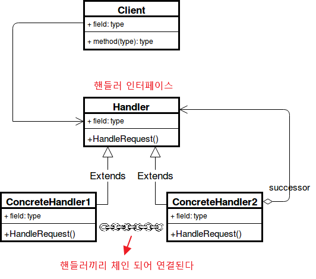

## **Chain Of Responsibility Pattern**

책임 연쇄 패턴(Chain Of Responsibility Pattern, COR)은 클라이어트의 요청에 대한 세세한 처리를 하나의 객체가 몽땅 하는 것이 아닌, 여러개의 **처리 객체**들로 나누고, 이들을 **사슬(chain)** 처럼 연결해 집합 안에서 연쇄적으로 처리하는 행동 패턴이다.

이러한 처리 객체들을 **핸들러(handler)**라고 부르는데, 요청을 받으면 각 핸들러는 요청을 처리할 수 있는지, 없으면 체인의 다음 핸들러로 처리에 대한 책임을 전가한다. 한마디로 책임 연쇄라는 말은 요청에 대한 책임을 다른 객체에 떠넘긴다는 소리이다. 떠넘긴다고 하니까 부정적인 의미로 들릴수도 있겠지만, 이러한 체인 구성은 하나의 객체에 처리에 대한 책임을 요청을 보내는 쪽(sender)과 요청을 처리하는(receiver) 쪽을 분리하여 각 객체를 부품으로 독립시키고 결합도를 느슨하게 만들며, 상황에 따라서 요청을 처리할 객체가 변하는 프로그램에도 유연하게 대응할 수 있다는 장점을 가지고 있다. 특히나 중첩 if-else문들을 최적화하는데 있어 실무에서도 많이 애용되는 패턴중 하나이기도 하다.

좀 더 접근하기 쉽게 실생활로 비유를 든다면, 예를들어 소비자가 문의를 위해 고객센터에 전화를 걸었다고 해보자. 그러면 아래와 같은 순서로 요청을 처리해본 경험을 한 번 씩은 겪어 봤을 것이다.

1. 첫 번째로, 자동 응답기 음성 로봇이 응답하게 된다. 그런데 만일 음성 로봇이 제시하는 해결책에 대해서 1부터 4까지 선택사항중 해당하는 번호가 없다면 아마 여러분도 그렇고 대다수의 사람들이 기타 버튼을 눌러 상담원 연결을 누를 것이다.
2. 두 번째로, 상담사가 전화를 받았지만 길게 통화한 결과 제대로된 기술적인 도움을 받지 못했다고 한다. 그러면 상담원이 직접 엔지니어에게 전화를 연결해주게 된다.
3. 세 번째로, 엔지니어와 통화하고 적합한 솔루션을 제시해줌으로써 문제가 해결되어 통화를 종료한다.

자동 응답기 -> 상담사 -> 엔지니어 체인 구성

마치 소비자의 요청에 대해 각 처리 서비스들이 무엇인가 체인처럼 연결되는 흐름이 되는 것 처럼 보일 것이다.

여기서 핸들러(Handler)는 자동 응답기 로봇, 상담사, 엔지니어가 된다. 즉, 각 핸들러에서 요청을 처리할 수 있는지의 여부를 따지고 불가능하면 다음 핸들러로  떠넘기는 과정을 진행한 것을 코드로 구현한 것이 책임 연쇄 패턴인 것이다.

---

### **책임 연쇄 패턴 구조**

[](img/cof-pattern.png)

- **Handler** : 요청을 수신하고 처리 객체들의 집합을 정의하는 인터페이스
- **ConcreteHandler** : 요청을 처리하는 실제 처리 객체

    - 핸들러에 대한 필드를 내부에 가지고 있으며 메서드를 통해 다음 핸들러를 체인시키고 다음  바라본다. 
    - 자신이 처리할 수 없는 요구가 나오면 바라보고 있는 다음 체인의 핸들러에게 요청을 떠넘긴다.
    - ConcreteHandler1 - ConcreteHandler2 - ConcreteHandler3 - ... 이런식으로 체인 형식이 구성되게 된다.

- **Client** : 요청을 Handler 전달한다

여기서 핸들러끼리 체이닝 되는 구조는 어떤 형태이든 상관이 없다. 리스트형 일수도 있고 선형 일 수도 있고 트리 형태일 수도 있다.

---

### ****책임 연쇄** 패턴 특징**

#### **패턴 사용 시기**

- 특정 요청을 2개 이상의 여러 객체에서 판별하고 처리해야 할때
- 특정 순서로 여러 핸들러를 실행해야 하는 경우
- 프로그램이 다양한 방식과 종류의 요청을 처리할 것으로 예상되지만 정확한 요청 유형과 순서를 미리 알 수 없는 경우
- 요청을 처리할 수 있는 객체 집합이 동적으로 정의되어야 할 때 (체인 연결을 런타임에서 동적으로 설정)

#### **패턴 장점**

- 클라이언트는 처리 객체의 체인 집합 내부의 구조를 알 필요가 없다.
- 각각의 체인은 자신이 해야하는 일만 하기 때문에 새로운 요청에 대한 처리객체 생성이 편리해진다.
- 클라이언트 코드를 변경하지 않고 핸들러를 체인에 동적으로 추가하거나 처리 순서를 변경하거나 삭제할 수 있어 유연해진다
- 요청의 호출자(invoker)와 수신자(receiver)  분리시킬 수 있다. 
    
    - 요청을 하는 쪽과 요청을 처리하는 쪽을 디커플링 시켜 결합도를 낮춘다
- 요청을 처리하는 방법이 바뀌더라도 호출자 코드는 변경되지 않는다.


#### **패턴 단점**

- 실행 시에 코드의 흐름이 많아져서 과정을 살펴보거나 디버깅 및 테스트가 쉽지 않다.
- 충분한 디버깅을 거치지 않았을 경우 집합 내부에서 무한 사이클이 발생할 수 있다.
- 요청이 반드시 수행된다는 보장이 없다. (체인 끝까지 갔는데도 처리되지 않을 수 있다)
- 책임 연쇄로 인한 처리 지연 문제가 발생할 수 있다. 다만 이는 트레이드 오프로서 요청과 처리에 대한 관계가 고정적이고 속도가 중요하면 책임 연쇄 패턴 사용을 유의하여야 한다.

## **실무에서 찾아보는 Chain Of Responsibility 패턴**

### **Java**

- java.util.logging.Logger의 log()
- javax.servlet.Filter의 doFilter()

사용자가 요청시 서블릿에 접근하기 전에 다양한 필터를 거치도록 할 수 있다. 만약 아래와 같은 컨트롤러가 있고, "/hello"로 요청을 받으면 필터를 타도록한다.

```java
@ServletComponentScan
@RestController
public class HelloController {
    @GetMapping("/hello")
    public String hello() {
        return "hello";
    }
}
```

```java
@WebFilter(urlPatterns = "/hello") // 특정 url 서블릿에 접근할시 다음 필터를 적용
public class MyFilter implements Filter {
    @Override
    public void doFilter(ServletRequest request, ServletResponse response, FilterChain chain) throws IOException, ServletException {
        System.out.println("게임 참여");
        chain.doFilter(request, response);
        System.out.println("게임 끝");
    }
}
```

---

### **Spring Framework**

스프링 프로젝트에 Spring Securiry 의존성을 추가하고 아래와 같이 Security 필터에 대한 체인을 설정을 할 수 있다.

```java
@Configuration
public class SecurityConfig extends WebSecurityConfigurerAdapter {
    
    // 체인 필터를 설정하는 코드
    @Override
    protected void configure(HttpSecurity http) throws Exception {
        // 모든 페이지의 접근권한을 인증없이 허가
        http.authorizeRequests().anyRequest().permitAll().and().addFilter(new MyFilter());
    }
}
```

출처: [https://inpa.tistory.com/entry/GOF-💠-Chain-Of-Responsibility-패턴-완벽-마스터하기](https://inpa.tistory.com/entry/GOF-%F0%9F%92%A0-Chain-Of-Responsibility-%ED%8C%A8%ED%84%B4-%EC%99%84%EB%B2%BD-%EB%A7%88%EC%8A%A4%ED%84%B0%ED%95%98%EA%B8%B0) [Inpa Dev 👨‍💻:티스토리] [Inpa Dev 👨‍💻:티스토리]