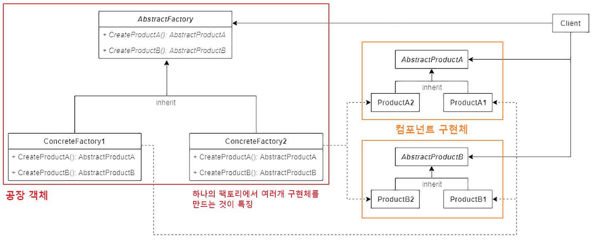
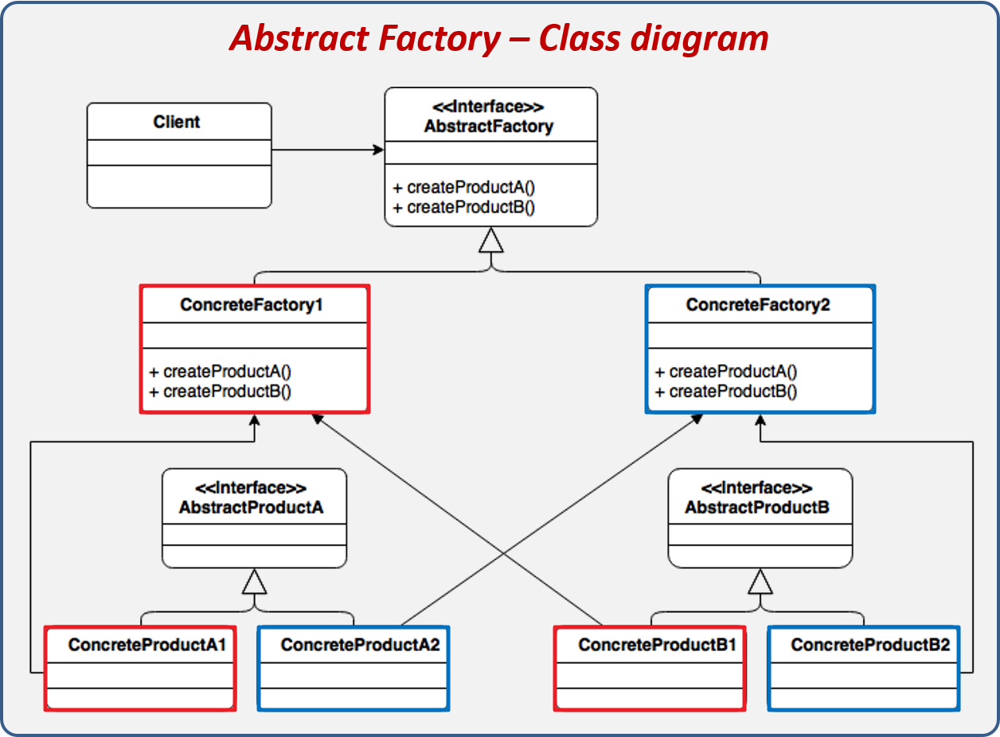
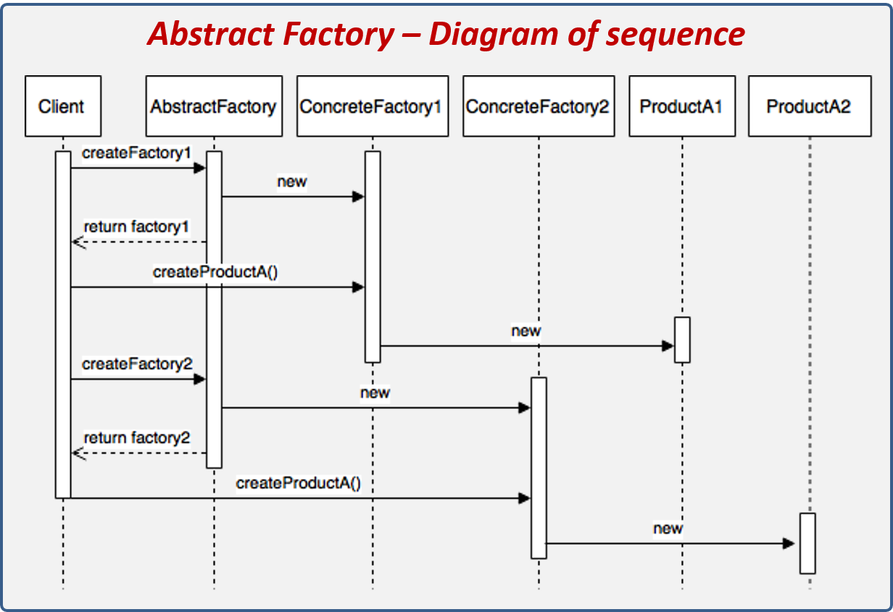
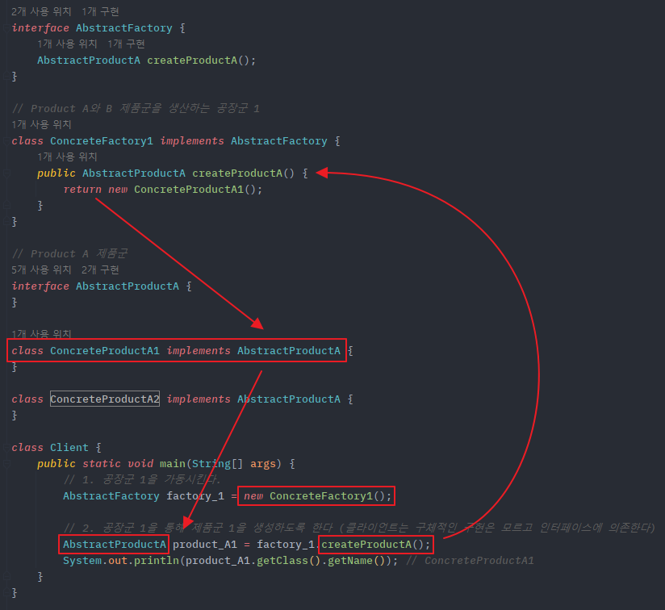

## **Abstract Factory Pattern**
https://blogshine.tistory.com/8

**추상 팩토리 패턴**은 연관성이 있는 **객체 군**이 여러개 있을 경우 이들을 묶어 추상화하고, 어떤 구체적인 상황이 주어지면 팩토리 객체에서 집합으로 묶은 객체 군을 구현화 하는 생성 패턴이다. 클라이언트에서 특정 객체을 사용할때 팩토리 클래스만을 참조하여 특정 객체에 대한 구현부를 감추어 역할과 구현을 분리시킬 수 있다.

즉, 추상 팩토리의 핵심은 **제품 '군' 집합**을 타입 별로 찍어낼수 있다는 점이 포인트 이다. 예를들어 모니터, 마우스, 키보드를 묶은 전자 제품군이 있는데 이들을 또 삼성 제품군이냐 애플 제품군이냐 로지텍 제품군이냐에 따라 집합이 브랜드 명으로 여러갈래로 나뉘게 될때, 복잡하게 묶이는 이러한 제품군들을 관리와 확장하기 용이하게 패턴화 한것이 추상 팩토리 이다.

---

### **추상 팩토리 패턴 구조**

[](img/abstract-factory-pattern.png)

- AbstractFactory : 최상위 공장 클래스. 여러개의 제품들을 생성하는 여러 메소드들을 추상화 한다.
- ConcreteFactory : 서브 공장 클래스들은 타입에 맞는 제품 객체를 반환하도록 메소드들을 재정의한다.
- AbstractProduct : 각 타입의 제품들을 추상화한 인터페이스
- ConcreteProduct (ProductA ~ ProductB) : 각 타입의 제품 구현체들. 이들은 팩토리 객체로부터 생성된다. 
- Client : Client는 추상화된 인터페이스만을 이용하여 제품을 받기 때문에, 구체적인 제품, 공장에 대해서는 모른다.

#### **Abstract Factory vs Factory Method**

둘다 팩토리 객체를 통해 구체적인 타입을 감추고 객체 생성에 관여하는 패턴 임에는 동일하다. 또한 공장 클래스가 제품 클래스를 각각 나뉘어 느슨한 결합 구조를 구성하는 모습 역시 둘이 유사하다.

그러나 주의할 것은 추상 팩토리 패턴이 팩토리 메서드 패턴의 상위 호환이 아니라는 점이다. 두 패턴의 차이는 명확하기 때문에 상황에 따라 적절한 선택을 해야 한다.  
예를들어 팩토리 메서드 패턴은 **객체 생성 이후 해야 할 일**의 공통점을 정의하는데 초점을 맞추는 반면, 추상 팩토리 패턴은 생성해야 할 **객체 집합 군**의 공통점에 초점을 맞춘다.

단, 이 둘을 유사점과 차이점을 조합해서 복합 패턴을 구성하는 것도 가능하다.

- **공통점**
    - 객체 생성 과정을 추상화한 인터페이스를 제공  <br>객체 생성을 캡슐화함으로써 구체적인 타입을 감추고 느슨한 결합 구조를 표방
- **차이점**
  - | **팩토리 메서드 패턴**                                                               |**추상 팩토리 패턴**|
    |------------------------------------------------------------------------------|---|
    | 구체적인 객체 생성과정을 하위 또는 구체적인 클래스로 옮기는 것이 목적                                      |관련 있는 여러 객체를 구체적인 클래스에 의존하지 않고 만들 수 있게 해주는 것이 목적|
    | 한 Factory당 한 종류의 객체 생성 지원                                                    |한 F actory에서 서로 연관된 여러 종류의 객체 생성을 지원. (제품군 생성 지원)|
    | 메소드 레벨에서 포커스를 맞춤으로써, 클라이언트의 ConcreteProduct 인스턴스의 생성 및 구성에 대한 의존을 감소|클래스 (Factory) 레벨에서 포커스를 맞춤으로써, 클라이언트의 ConcreteProduct 인스턴스 군의 생성 및 구성에 대한 의존을 감소|

---

### **추상 팩토리 패턴** **흐름**

클래스 다이어그램 그림을 보면 구성요소와 화살표가 얼키고 섥혀 복잡하게 보일테지만, 실상 파고보면 별거 아닌 구조이니 겁 먹을 필요가 없다.

#### **클래스 구성**

[](img/abstract-factory-class-dgrm.png)

**제품(Product) 클래스**

```java
// Product A 제품군
interface AbstractProductA {
}

// Product A - 1
class ConcreteProductA1 implements AbstractProductA {
}

// Product A - 2
class ConcreteProductA2 implements AbstractProductA {
}
```

```java
// Product B 제품군
interface AbstractProductB {
}

// Product B - 1
class ConcreteProductB1 implements AbstractProductB {
}

// Product B - 2
class ConcreteProductB2 implements AbstractProductB {
}
```

**공장(Factory) 클래스**

```java
interface AbstractFactory {
    AbstractProductA createProductA();
    AbstractProductB createProductB();
}

// Product A1와 B1 제품군을 생산하는 공장군 1 
class ConcreteFactory1 implements AbstractFactory {
    public AbstractProductA createProductA() {
        return new ConcreteProductA1();
    }
    public AbstractProductB createProductB() {
        return new ConcreteProductB1();
    }
}

// Product A2와 B2 제품군을 생산하는 공장군 2
class ConcreteFactory2 implements AbstractFactory {
    public AbstractProductA createProductA() {
        return new ConcreteProductA2();
    }
    public AbstractProductB createProductB() {
        return new ConcreteProductB2();
    }
}
```

#### **클래스 흐름**

[](img/abstract-factory-class-seq.png)

```java
class Client {
    public static void main(String[] args) {
    	AbstractFactory factory = null;
        
        // 1. 공장군 1을 가동시킨다.
        factory = new ConcreteFactory1();

        // 2. 공장군 1을 통해 제품군 A1를 생성하도록 한다 (클라이언트는 구체적인 구현은 모르고 인터페이스에 의존한다)
        AbstractProductA product_A1 = factory.createProductA();
        System.out.println(product_A1.getClass().getName()); // ConcreteProductA1

        // 3. 공장군 2를 가동시킨다.
        factory = new ConcreteFactory2();

        // 4. 공장군 2를 통해 제품군 A2를 생성하도록 한다 (클라이언트는 구체적인 구현은 모르고 인터페이스에 의존한다)
        AbstractProductA product_A2 = factory.createProductA();
        System.out.println(product_A2.getClass().getName()); // ConcreteProductA2
    }
}
```

코드를 보면 똑같은 **createProductA()** 메서드를 호출하지만 어떤 팩토리 객체이냐에 따라 반환되는 제품군이 다르게 된다.

[](img/abstract-factory-class-img.png)

---

### **추상 팩토리 패턴** **특징**

#### **패턴 사용 시기**

- 관련 제품의 다양한 제품 군과 함께 작동해야 할때, 해당 제품의 구체적인 클래스에 의존하고 싶지 않은 경우
- 여러 제품군 중 하나를 선택해서 시스템을 설정해야하고 한 번 구성한 제품을 다른 것으로 대체할 수도 있을 때
- 제품에 대한 클래스 라이브러리를 제공하고, 그들의 구현이 아닌 인터페이스를 노출시키고 싶을 때

#### **패턴 장점**

- 객체를 생성하는 코드를 분리하여 클라이언트 코드와 결합도를 낮출 수 있다.
- 제품 군을 쉽게 대체 할 수 있다.
- [단일 책임 원칙 준수Visit Website](https://inpa.tistory.com/entry/OOP-%F0%9F%92%A0-%EC%95%84%EC%A3%BC-%EC%89%BD%EA%B2%8C-%EC%9D%B4%ED%95%B4%ED%95%98%EB%8A%94-SRP-%EB%8B%A8%EC%9D%BC-%EC%B1%85%EC%9E%84-%EC%9B%90%EC%B9%99)
- [개방 / 폐쇄 원칙 준수Visit Website](https://inpa.tistory.com/entry/OOP-%F0%9F%92%A0-%EC%95%84%EC%A3%BC-%EC%89%BD%EA%B2%8C-%EC%9D%B4%ED%95%B4%ED%95%98%EB%8A%94-SRP-%EB%8B%A8%EC%9D%BC-%EC%B1%85%EC%9E%84-%EC%9B%90%EC%B9%99)

#### **패턴 단점**

- 각 구현체마다 팩토리 객체들을 모두 구현해주어야 하기 때문에 객체가 늘어날때 마다 클래스가 증가하여 코드의 복잡성이 증가한다. (팩토리 패턴의 공통적인 문제점)
- 기존 추상 팩토리의 세부사항이 변경되면 모든 팩토리에 대한 수정이 필요해진다. 이는 추상 팩토리와 모든 서브클래스의 수정을 가져온다. 
- 새로운 종류의 제품을 지원하는 것이 어렵다. 새로운 제품이 추가되면 팩토리 구현 로직 자체를 변경해야한다.


## **실무에서 찾아보는 추상 팩토리 패턴**

### **Java**

- javax.xml.parsers.DocumentBuilderFactory 의 newInstance()
- javax.xml.transform.TransformerFactory 의 newInstance()
- javax.xml.xpath.XPathFactory 의 newInstance()

#### **DocumentBuilderFactory 의 newInstance()**

Java는 xml형식의 문서를 객체화 시켜 살펴볼 수 있는 DocumentBuilder 객체를 제공하는데 이 객체는 바로 DocumentBuilderFactory로부터 얻어올 수 있다. 

~~newInstance()~~를 통해 얻어오는 DocumentBuilderFactory 타입의 객체가 ConcreteFactory에 해당하고 ConcreteFactory가 제공하는 DocumentBuilder가 추상화된 객체(제품)에 해당하게 된다.

```java
public static void main(String[] args) throws ParserConfigurationException, IOException, SAXException {
    // 1. 공장 객체 생성
    DocumentBuilderFactory factory = DocumentBuilderFactory.newInstance();
    
    // 2. 공장 객체를 통해 추상화된 제품 객체 생성
    DocumentBuilder builder = factory.newDocumentBuilder();
    
    // 3. 구현체 메소드 실행
    Document document = builder.parse("src/main/resources/config.xml");
    System.out.println(document.getDocumentElement());
}
```

---

### **Spring Framework**

#### **FactoryBean**

FactoryBean은 스프링이 제공하는 인터페이스로, 기본으로 제공되는 스프링 구문으로는 생성 및 관리할 수 없는 객체를 Bean으로 활용할 수 있게끔 어댑터 역할을 한다. 여기서 생성 및 관리할 수 없는 객체란 생성자가 private한 싱글톤 객체 혹은 [정적 팩토리 메서드Visit Website](https://inpa.tistory.com/entry/GOF-%F0%9F%92%A0-%EC%A0%95%EC%A0%81-%ED%8C%A9%ED%86%A0%EB%A6%AC-%EB%A9%94%EC%84%9C%EB%93%9C-%EC%83%9D%EC%84%B1%EC%9E%90-%EB%8C%80%EC%8B%A0-%EC%82%AC%EC%9A%A9%ED%95%98%EC%9E%90-%F0%9F%92%A1)를 통해 얻어오는 객체가 이에 해당한다. 

예를 들면 아래 Ship 클래스는 싱글톤 처리된 객체이다.

```java
public class Ship {
    private static final Ship INSTANCE = new Ship();

    private String name = "Singleton_TurtleShip";
    private String color = "Green";
    private String logo = "\uD83D\uDC22";
 
    private Ship(){}
    
    public static Ship getInstance() {
        return INSTANCE;
    }
}
```

만약 싱글톤 객체를 Bean으로 활용하고 싶다면 FactoryBean을 이용해 등록할 수 있다. FactoryBean의 구현체(ShipFactory)를 만들고 구현체를 Bean으로 등록하면, ShipFactory의 ~~getObject()~~에서 반환하는 객체가 최종적으로 Bean으로 등록되게 된다.

즉, 여기서 FactoryBean은 추상 팩토리의 AbstractFactory에 해당하고 ShipFactory는 ConcreteFactory에 해당한다.

```java
public class ShipFactory implements FactoryBean<Ship> {
    @Override
    public Ship getObject() throws Exception {
        return Ship.getInstance();
    }
 
    @Override
    public Class<?> getObjectType() {
        return Ship.class;
    }
}
```

클라이언트에서 실행 해보면 xml에 등록된 정보에 따라 ApplicationContext로부터 가져올 떄 ShipFactory가 제공하는 싱글톤 객체를 얻어오게 된다.

```xml
<!-- config.xml -->
<bean id="myShip" class="ShipFactory">

</bean>
```

```java
public static void main(String[] args) throws Exception {
    ApplicationContext applicationContext = new ClassPathXmlApplicationContext("config.xml");
    
    Ship myShip = applicationContext.getBean("myShip");
    System.out.println(myShip);
}
```

출처: [https://inpa.tistory.com/entry/GOF-💠-추상-팩토리Abstract-Factory-패턴-제대로-배워보자](https://inpa.tistory.com/entry/GOF-%F0%9F%92%A0-%EC%B6%94%EC%83%81-%ED%8C%A9%ED%86%A0%EB%A6%ACAbstract-Factory-%ED%8C%A8%ED%84%B4-%EC%A0%9C%EB%8C%80%EB%A1%9C-%EB%B0%B0%EC%9B%8C%EB%B3%B4%EC%9E%90) [Inpa Dev 👨‍💻:티스토리]

