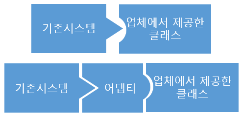
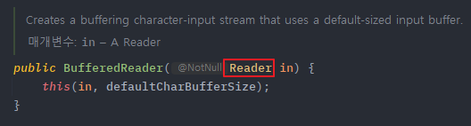
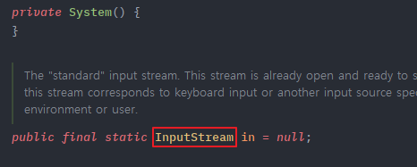
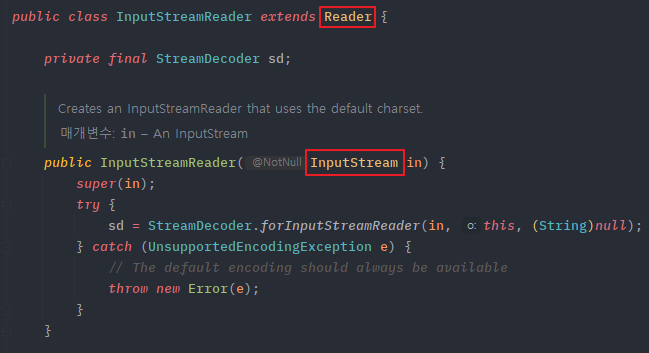
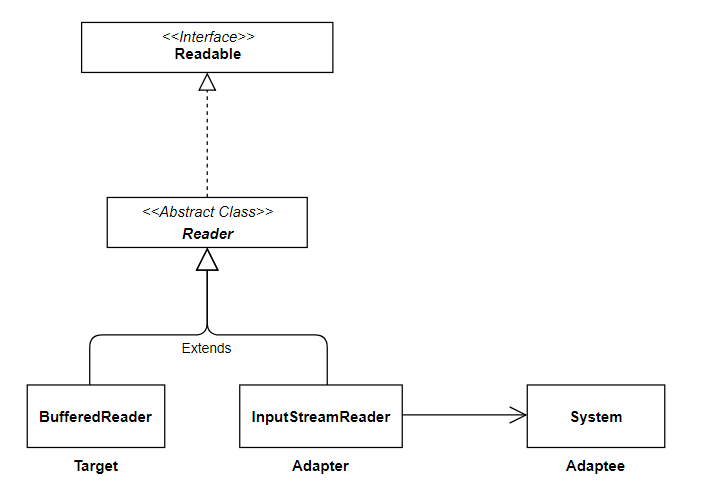

## **Adaptor Pattern**
https://blogshine.tistory.com/11

어댑터 패턴(Adaptor Pattern) 이란 이름 그대로 클래스를 어댑터로서 사용되는 구조 패턴이다.

어댑터는 우리 주변에도 많이 볼 수 있는 것으로서, 대표적으로 110V 전용 가전제품에 220V 어댑터를 끼워 사용하는 걸 들 수 있다. 즉, 서로 호환이 되지 않은 단자를 어댑터로 호환시켜 작동시키게끔 하는 것이 어댑터의 역할인 것이다.

이를 객체 지향 프로그래밍에 접목해보면, 호환성이 없는 인터페이스 때문에 함께 동작할 수 없는 클래스들을 함께 작동해주도록 변환 역할을 해주는 행동 패턴이라고 보면 된다.  예를들어 기존에 있는 시스템에 새로운 써드파티 라이브러리를 추가하고 싶거나, Legacy 인터페이스를 새로운 인터페이스로 교체하는 경우에 어댑터 패턴을 사용하면 코드의 재사용성을 높일 수 있다.

[](img/adapter.png)

어댑터를 이용해 기존 시스템에 업체의 클래스를 호환시켜 접목시킨다

즉, 어댑터란 이미 구축되어 있는 것을 새로운 어떤것에 사용할때 양 쪽 간의 호환성을 유지해 주기 위해 사용하는 것으로서, 기존 시스템에서 새로운 업체에서 제공하는 기능을 사용하려고 할때 서로 간의 인터페이스를 어댑터로 일치시켜줌으로써 호환성 및 신규 기능 확장을 할수 있다고 보면 된다.

> Tip
>
> 어댑터가 Legacy 인터페이스를 감싸서 새로운 인터페이스로 변환하기 때문에 Wrapper 패턴이라고도 불리운다.
---

### **어댑터 패턴 구조**

Adapter 패턴에는 기존 시스템의 클래스를 **상속(Inheritance)** 해서 호환 작업을 해주냐, **합성(Composition)** 해서 호환 작업을 해주냐에 따라, 두 가지 패턴 방법으로 나뉘게 된다.

#### **객체 어댑터 (Object Adaptor)**

- 합성(Composition)된 맴버에게 위임을 이용한 어댑터 패턴 (추천 🌟)
- 자기가 해야 할 일을 클래스 맴버 객체의 메소드에게 다시 시킴으로써 목적을 달성하는 것을 위임이라고 한다.
- 합성을 활용했기 때문에 런타임 중에 Adaptee(Service)가 결정되어 유연하다.
- 그러나 Adaptee(Service) 객체를 필드 변수로 저장해야 되기 때문에 공간 차지 비용이 든다.

[](img/object-adapter.png)

- **Adaptee(Service)** : 어댑터 대상 객체. 기존 시스템 / 외부 시스템 / 써드파티 라이브러리
- **Target(Client Interface)** : Adapter 가 구현하는 인터페이스.
- **Adapter** : Client 와 Adaptee(Service) 중간에서 호환성이 없는 둘을 연결시켜주는 역할을 담당.

    - Object Adaptor 방식에선 합성을 이용해 구성한다.
    - Adaptee(Service)를 따로 클래스 멤버로 설정하고 위임을 통해 동작을 매치시킨다.

- **Client** : 기존 시스템을 어댑터를 통해 이용하려는 쪽. Client Interface를 통하여 Service를 이용할 수 있게 된다.

```java
// Adaptee : 클라이언트에서 사용하고 싶은 기존의 서비스 (하지만 호환이 안되서 바로 사용 불가능)
class Service {

    void specificMethod(int specialData) {
        System.out.println("기존 서비스 기능 호출 + " + specialData);
    }
}

// Client Interface : 클라이언트가 접근해서 사용할 고수준의 어댑터 모듈
interface Target {
    void method(int data);
}

// Adapter : Adaptee 서비스를 클라이언트에서 사용하게 할 수 있도록 호환 처리 해주는 어댑터
class Adapter implements Target {
    Service adaptee; // composition으로 Service 객체를 클래스 필드로

    // 어댑터가 인스턴스화되면 호환시킬 기존 서비스를 설정
    Adapter(Service adaptee) {
        this.adaptee = adaptee;
    }

    // 어댑터의 메소드가 호출되면, Adaptee의 메소드를 호출하도록
    public void method(int data) {
        adaptee.specificMethod(data); // 위임
    }
}
```

```java
class Client {
    public static void main(String[] args) {
        // 1. 어댑터 생성 (기존 서비스를 인자로 받아 호환 작업 처리)
        Target adapter = new Adapter(new Service());

        // 2. Client Interfac의 스펙에 따라 메소드를 실행하면 기존 서비스의 메소드가 실행된다.
        adapter.method(1);
        
        // 
        // 기존서비스 기능 호출 + 1 출력
    }
}
```

#### **클래스 어댑터 (Class Adaptor)**

- 클래스 상속을 이용한 어댑터 패턴
- Adaptee(Service)를 상속했기 때문에 따로 객체 구현없이 바로 코드 재사용이 가능하다.
- 상속은 대표적으로 기존에 구현된 코드를 재사용하는 방식이지만, 자바에서는 다중 상속 불가 문제 때문에 전반적으로 권장하지는 않는 방법이다.

[](img/class-adapter.png)

- **Adaptee(Service)** : 어댑터 대상 객체. 기존 시스템 / 외부 시스템 / 써드파티 라이브러리
- **Target(Cient Interface)** : Adapter 가 구현하는 인터페이스.
- **Adapter** : Client 와 Adaptee(Service) 중간에서 호환성이 없는 둘을 연결시켜주는 역할을 담당.

    - Class Adaptor 방식에선 상속을 이용해 구성한다.
    - Existing Class와 Adaptee(Service) 를 동시에 implements, extends 하여 구현한다.

- **Client** : 기존 시스템을 어댑터를 통해 이용하려는 쪽. Client Interface를 통하여 Service를 이용할 수 있게 된다.

```java
// Adaptee : 클라이언트에서 사용하고 싶은 기존의 서비스 (하지만 호환이 안되서 바로 사용 불가능)
class Service {

    void specificMethod(int specialData) {
        System.out.println("기존 서비스 기능 호출 + " + specialData);
    }
}

// Client Interface : 클라이언트가 접근해서 사용할 고수준의 어댑터 모듈
interface Target {
    void method(int data);
}

// Adapter : Adaptee 서비스를 클라이언트에서 사용하게 할 수 있도록 호환 처리 해주는 어댑터
class Adapter extends Service implements Target {

    // 어댑터의 메소드가 호출되면, 부모 클래스 Adaptee의 메소드를 호출
    public void method(int data) {
        specificMethod(data);
    }
}
```

```java
class Client {
    public static void main(String[] args) {
        // 1. 어댑터 생성
        Target adapter = new Adapter();

        // 2. 인터페이스의 스펙에 따라 메소드를 실행하면 기존 서비스의 메소드가 실행된다.
        adapter.method(1);

      // 
      // 기존서비스 기능 호출 + 1 출력
    }
}
```

---

### **어댑터 패턴** **특징**

#### **패턴 사용 시기**

- 레거시 코드를 사용하고 싶지만 새로운 인터페이스가 레거시 코드와 호환되지 않을 때
- 이미 만든 것을 재사용하고자 하나 이 재사용 가능한 라이브러리를 수정할 수 없을 때
- 이미 만들어진 클래스를 새로운 인터페이스(API)에 맞게 개조할때
- 소프트웨어의 구 버전과 신 버전을 공존시키고 싶을때

> Tip
>
> 기존의 클래스를 새로운 인터페이스에 맞게 개조하고 싶을때, 우리는 기존 클래스의 소스를 바꾸어 수정을 해왔었다. 하지만 이런식으로 프로그램을 운용하면 이미 동작 테스트가 끝난 기존의 클래스를 다시 한번 테스트 해야 한다. 만일 클래스 소스가 몇천줄이라면 운용하기 꽤나 힘들 것이다.  
> 이러한 관점에서 어댑터(Adapter) 패턴은 기존의 클래스를 수정하지 않고 새로운 인터페이스에 맞게 호환작업을 중계하여 해주는 것이다.

#### **패턴 장점**

- 프로그램의 기본 비즈니스 로직에서 인터페이스 또는 데이터 변환 코드를 분리할 수 있기 때문에 단일 책임 원칙(SRP)을 만족한다.
- 기존 클래스 코드를 건들지 않고 클라이언트 인터페이스를 통해 어댑터와 작동하기 때문에 개방 폐쇄 원칙(OCP)을 만족한다.
- 만일 추가로 필요한 메소드가 있다면 어댑터에 빠르게 만들 수 있다. 만약 버그가 발생해도 기존의 클래스에는 버그가 없으므로 Adapter 역할의 클래스를 중점적으로 조사하면 되고, 프로그램 검사도 쉬워진다.

#### **패턴 단점**

- 새로운 인터페이스와 어댑터 클래스 세트를 도입해야 하기 때문에 코드의 복잡성이 증가한다. 
- 때로는 직접 서비스(Adaptee) 클래스를 변경하는것이 간단할수 있는 경우가 있기 때문에 신중히 선택하여야 한다.

## **실무에서 찾아보는 Adaptor 패턴**

### **Java**

- java.util.Arrays 의 asList()
- java.util.Collections 의 list()
- java.util.Collections 의 enumeration()
- java.io.InputStreamReader(InputStream) (returns a Reader)
- java.io.OutputStreamWriter(OutputStream) (returns a Writer)
- javax.xml.bind.annotation.adapters.XmlAdapter 의 marshal() and unmarshal()

#### **InputStreamReader**

콘솔에서 입력을 받고 싶을때 Scanner 클래스와 가장 많이 사용하는 것이 BufferedReader 인데, 아래와 같이 생성자 인자로 InpuStreamReader 객체를 넣어 사용하는 것을 본 적이 있을 것이다.

```java
BufferedReader br = new BufferedReader(new InputStreamReader(System.in));
```

이 코드의 핵심은 input을 행하는 System.in 을 BufferedReader 객체에 사용하고 싶은데 이 중간을 InpuStreamReader 가 어댑터 역할을 하고 있는 것이다.

먼저 BufferedReader 클래스를 살펴보면 생성자에 아래와 같이 Reader 타입을 받는걸 볼 수 있다.

[](img/bufferreader-img.png)

하지만 System 클래스의 in 필드를 보면 InputStream 타입으로 구성되어 있다. 즉, 서로 타입이 맞지 않아 ~~BufferedReader(System.in)~~ 과 같이 사용할수 없는 것이다.

[](img/inputstream-img.png)

그래서 이 둘을 연결시켜 주는 어댑터가 InputStreamReader 클래스이다.

InputStreamReader 클래스는 생성자로 InputStream 타입을 받고 인스턴스화 하며, InputStreamReader 클래스 자체가 Reader 추상 클래스를 상속하고 있기 때문에 업캐스팅으로 변환하여 BufferedReader의 생성자 인자로 들어가게 해주는 것이다.

[](img/inputstream-class.png)

이 구조를 UML 로 보면 아래와 같게 된다. BufferedReader 클래스와 InputStreamReader 클래스는 Reader 추상 클래스를 동시에 상속받고 있다.

InputStreamReader 클래스는 InputStream 타입을 받을 수 있는 생성자를 가지고 있으므로, System.in 을 InputStreamReader 생성자에 넘겨 인스턴스화 하면, 같은 Reader 부모 클래스를 상속하고 있는 BufferedReader의 생성자의 인자로 넘겨줄수 있기 때문에, 마치 System.in 을 BufferedReader에 넣은 것처럼 호환 역할을 InputStreamReader 가 어댑터로서 행하고 있다고 볼 수 있다.

[](img/adapter-inpustream.png)

따라서 정리하면 InputStreamReader 클래스를 Adapter, System.in 을 Adaptee, Reader 를 Target Interface 라고 할 수 있다.

#### **Arrays의 asList()**

기존의 배열(Array)을 리스트(List)로 변환 & 호환 작업을 해주는 **Arrays.asList()** 도 어찌보면 어댑터라고 볼 수 있다.

```java
public static void main(String[] args) {
	// String 배열 : adaptee 기존 서비스
    String[] s = {"a", "b", "c"};
    
    // List<String> : target 인터페이스
    List<String> list
    
    // Arrays.asList() : adapter 기존 서비스 배열을 리스트로 변환 & 호환하게 해주는 역할
    list = Arrays.asList(s);
}
```

#### **Collections의 enumeration()**

역시나 리스트와 Enumeration 간의 변환 & 호환 작업을 해주는 Collections 의 정적 메서드도 어댑터라고 볼 수 있다.

```java
public static void main(String[] args) {

	// 리스트 : adaptee 기존 서비스
	List<String> list = new ArrayList<>();
    list.add("a");
    list.add("b");
    list.add("c");
    
    // Enumeration<String> : target 인터페이스
    Enumeration<String> enum
    
    // adapter 기존 서비스 배열을 리스트로 변환 & 호환하게 해주는 역할
    enum = Collections.enermeration(list); // list → enermeration
    ArrayList<String list2 = Collections.list(enum) // enermeration → list
}
```

출처: [https://inpa.tistory.com/entry/GOF-💠-어댑터Adaptor-패턴-제대로-배워보자](https://inpa.tistory.com/entry/GOF-%F0%9F%92%A0-%EC%96%B4%EB%8C%91%ED%84%B0Adaptor-%ED%8C%A8%ED%84%B4-%EC%A0%9C%EB%8C%80%EB%A1%9C-%EB%B0%B0%EC%9B%8C%EB%B3%B4%EC%9E%90) [Inpa Dev 👨‍💻:티스토리]