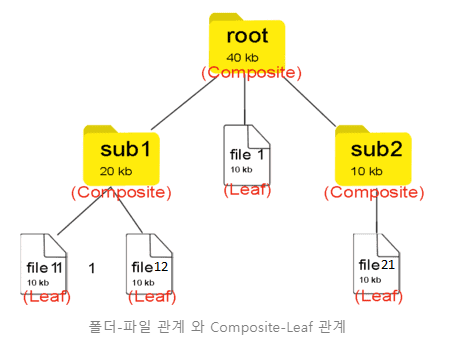
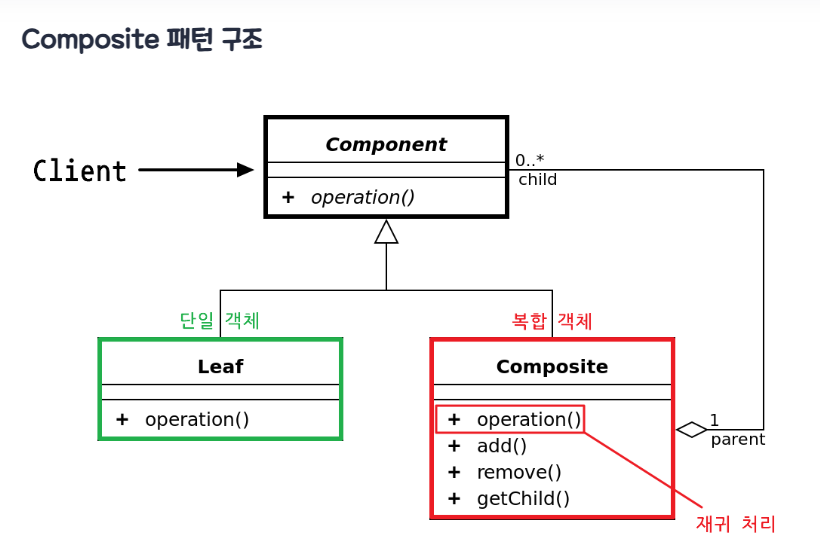
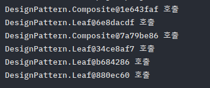
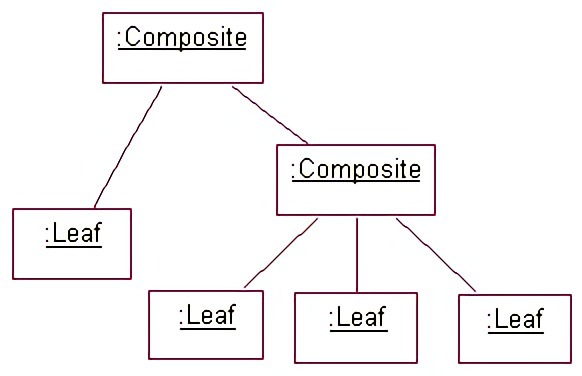
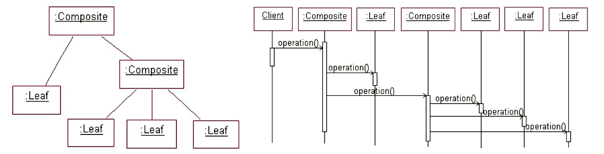

## **Composite Pattern**
https://blogshine.tistory.com/15

복합체 패턴(Composite Pattern)은 **복합 객체(Composite)** 와 **단일 객체(Leaf)** 를 동일한 컴포넌트로 취급하여, 클라이언트에게 이 둘을 구분하지 않고 동일한 인터페이스를 사용하도록 하는 구조 패턴이다.

복합체 패턴은 전체-부분의 관계를 갖는 객체들 사이의 관계를 트리 계층 구조로 정의해야 할때 유용하다. 윈도우나 리눅스의 **파일 시스템 구조**를 떠올려보면 쉽게 이해할 수 있다.

폴더(디렉토리) 안에는 파일이 들어 있을수도 있고 파일을 담은 또 다른 폴더도 들어있을 수 있다. 이를 복합적으로 담을수 있다 해서 Composite 객체라고 불리운다. 반면 파일은 단일 객체 이기 때문에 이를 Leaf 객체라고 불리운다. 즉 Leaf는 자식이 없다.

[](img/composite-leaf.png)

폴더-파일 관계 와 Composite-Leaf 관계

복합체 패턴은 바로 이 폴더와 파일을 동일한 타입으로 취급하여 구현을 단순화 시키는 것이 목적이다. 폴더 안에는 파일 뿐만 아니라 서브 폴더가 올수 있고 또 서브 폴더안에 서브 폴더가 오고.. 이런식으로 계층 구조를 구현하다 보면, 자칫 복잡해 질 수 도 있는 복합 객체를 **재귀 동작**을 통해 하위 객체들에게 작업을 위임한다. 그러면 복합 객체와 단일 객체를 대상으로 똑같은 작업을 적용할 수 있어 단일 / 복합 객체를 구분할 필요가 거의 없어진다.
> Tip
>
> 윈도우에선 폴더와 파일은 엄연히 다른 놈이지만, 리눅스(Unix)에선 디렉토리와 파일은 모두 파일로 취급된다. 어찌보면 리눅스 OS가 복합체(Composite) 패턴을 통해 계층 구조를 구현하였다고 볼 수 있다.   
> 당연히 실제 설계는 다르겠지만, 복합체 패턴은 입문하기 어려운 패턴중 하나이기에 이러한 비유를 통해 좀더 패턴에 친숙하게 접근하도록 해보자.

정리하자면, Composite 패턴은 그릇과 내용물을 동일시해서 재귀적인 구조를 만들기 위한 디자인 패턴이라고 말할 수 있다.

---

### **Composite 패턴 구조**

[](img/composite-pattern.png)

- **Component** : Leaf와 Compsite 를 묶는 공통적인 상위 인터페이스
- **Composite** : 복합 객체로서, Leaf 역할이나 Composite 역할을 넣어 관리하는 역할을 한다.
    
    - Component 구현체들을 내부 리스트로 관리한다
    - add 와 remove 메소드는 내부 리스트에 단일 / 복합 객체를 저장
    - Component 인터페이스의 구현 메서드인 operation은 복합 객체에서 호출되면 재귀 하여, 추가 단일 객체를 저장한 하위 복합 객체를 순회하게 된다.

- **Leaf**: 단일 객체로서, 단순하게 내용물을 표시하는 역할을 한다.

  - Component 인터페이스의 구현 메서드인 operation은 단일 객체에서 호출되면 적절한 값만 반환한다

- **Client** : 클라이언트는 Component를 참조하여 단일 / 복합 객체를 하나의 객체로서 다룬다.

복합체 패턴의 핵심은 Composite 와 Leaf가 동시에 구현하는 **operation()** 인터페이스 추상 메서드를 정의하고, Composite 객체의 **operation()** 메서드는 자기 자신을 호출하는 재귀 형태로 구현하는 것이다. 왜냐하면 폴더 안에 폴더를 넣고, 그 안에 또 폴더를 넣고 파일을 넣는 트리 구조를 생각해보면, 재귀적으로 반복되는 형식이 나타나기 때문이다. 그래서 단일체와 복합체를 동일한 개체로 취급하여 처리하기 위해 재귀 함수 원리를 이용한다.

---

### **Composite 패턴** **흐름**

#### **클래스 구성**

```java
interface Component {
    void operation();
}
```

```java
class Leaf implements Component {

    @Override
    public void operation() {
        System.out.println(this + " 호출");
    }
}
```

```java
class Composite implements Component {

    // Leaf 와 Composite 객체 모두를 저장하여 관리하는 내부 리스트
    List<Component> components = new ArrayList<>();

    public void add(Component c) {
        components.add(c); // 리스트 추가
    }

    public void remove(Component c) {
        components.remove(c); // 리스트 삭제
    }

    @Override
    public void operation() {
        System.out.println(this + " 호출");
        
        // 내부 리스트를 순회하여, 단일 Leaf이면 값을 출력하고,
        // 또다른 서브 복합 객체이면, 다시 그 내부를 순회하는 재귀 함수 동작이 된다.
        for (Component component : components) {
            component.operation(); // 자기 자신을 호출(재귀)
        }
    }
    
    public List<Component> getChild() {
        return components;
    }
}
```

#### **클래스 흐름**
```java
class Client {
    public static void main(String[] args) {
        // 1. 최상위 복합체 생성
        Composite composite1 = new Composite();

        // 2. 최상위 복합체에 저장할 Leaf와 또다른 서브 복합체 생성
        Leaf leaf1 = new Leaf();
        Composite composite2 = new Composite();

        // 3. 최상위 복합체에 개체들을 등록
        composite1.add(leaf1);
        composite1.add(composite2);

        // 4. 서브 복합체에 저장할 Leaf 생성
        Leaf leaf2 = new Leaf();
        Leaf leaf3 = new Leaf();
        Leaf leaf4 = new Leaf();

        // 5. 서브 복합체에 개체들을 등록
        composite2.add(leaf2);
        composite2.add(leaf3);
        composite2.add(leaf4);

        // 6. 최상위 복합체의 모든 자식 노드들을 출력
        composite1.operation();
    }
}
```

[](img/composite-print.png)


[](img/composite-class.jpg)
[](img/composite-sequence.png)

클라이언트에서 operation 메서드를 호출하게 되면, 단일체일 경우 값이 호출 되고, 복합체일 경우 자기 자신을 호출하는 재귀 함수에 의해 저장하고 있는 하위 Leaf 객체들을 순회하여 호출하게 된다.

---

### **Composite 패턴 특징**

#### **패턴 사용 시기**

- 데이터를 다룰때 **계층적** 트리 표현을 다루어야 할때
- 복잡하고 난해한 단일 / 복합 객체 관계를 간편히 단순화하여 균일하게 처리하고 싶을때

#### **패턴 장점**

- 단일체와 복합체를 동일하게 여기기 때문에 묶어서 연산하거나 관리할 때 편리하다.
- 다형성 재귀를 통해 복잡한 트리 구조를 보다 편리하게 구성 할 수 있다. 
- 수평적, 수직적 모든 방향으로 객체를 확장할 수 있다.
- 새로운 Leaf 클래스를 추가하더라도 클라이언트는 추상화된 인터페이스 만을 바라보기 때문에 개방 폐쇄 원칙(OCP)을 준수 한다. (단일 부분의 확장이 용이)

#### **패턴 단점**

- 재귀 호출 특징 상 트리의 깊이(depth)가 깊어질 수록 디버깅에 어려움이 생긴다.
- 설계가 지나치게 범용성을 갖기 때문에 새로운 요소를 추가할 때 복합 객체에서 구성 요소에 제약을 갖기 힘들다.

- 예를들어, 계층형 구조에서 leaf 객체와 composite 객체들을 모두 동일한 인터페이스로 다루어야하는데, 이 공통 인터페이스 설계가 까다로울 수 있다.

  - 복합 객체가 가지는 부분 객체의 종류를 제한할 필요가 있을 때
  - 수평적 방향으로만 확장이 가능하도록 Leaf를 제한하는 Composite를 만들때

출처: https://inpa.tistory.com/entry/GOF-💠-복합체Composite-패턴-완벽-마스터하기 [Inpa Dev 👨‍💻:티스토리]