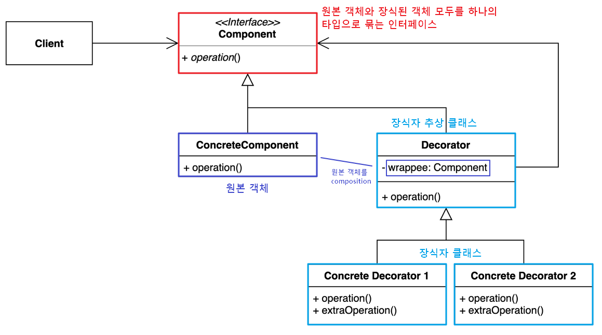
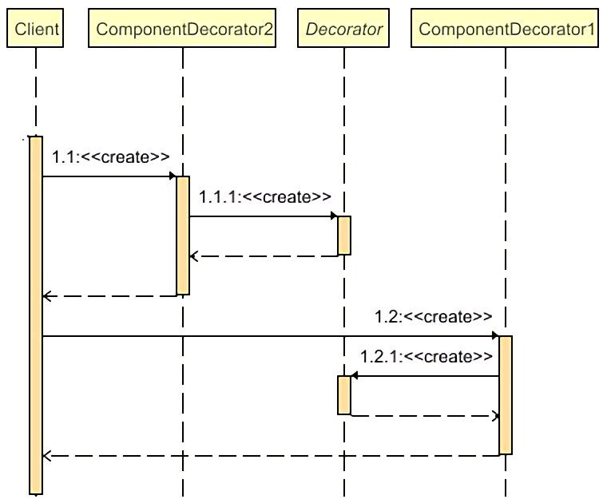

## **Decorator Pattern**
https://blogshine.tistory.com/7

데코레이터 패턴(Decorator Pattern)은 대상 객체에 대한 기능 확장이나 변경이 필요할때 객체의 결합을 통해 서브클래싱 대신 쓸수 있는 유연한 대안 구조 패턴이다.

Decorator을 해석하자면 '장식자' 라는 의미를 가지고 있는데,  마치 기본 제품에 포장지나 외부 디자인을 살짝 변경해 줌으로써 새로운 기능을 부여하는 것과 같이, 객체 지향 프로그래밍에서 원본 객체에 대해서 무언가를 장식하여 더 멋진 기능을 가지게 만드는 것이기 때문에 이 명칭이 붙었다고 보면 된다.

데코레이터 패턴을 이용하면 필요한 추가 기능의 조합을 런타임에서 동적으로 생성할 수 있다. 데코레이터할 대상 객체를 새로운 행동들을 포함한 특수 장식자 객체에 넣어서 행동들을 해당 장식자 객체마다 연결시켜, 서브클래스로 구성할때 보다 훨씬 유연하게 기능을 확장 할 수 있다. 그리고 기능을 구현하는 클래스들을 분리함으로써 수정이 용이해진다.

---

### **데코레이터 패턴 구조**

[](img/decorator-pattern.png)

- Component (Interface) : 원본 객체와 장식된 객체 모두를 묶는 역할
- ConcreteComponent : 원본 객체 (데코레이팅 할 객체)
- Decorator : 추상화된 장식자 클래스

    - 원본 객체를 합성(composition)한 wrappee 필드와 인터페이스의 구현 메소드를 가지고 있다

- ConcreteDecorator : 구체적인 장식자 클래스

    - 부모 클래스가 감싸고 있는 하나의 Component를 호출하면서 호출 전/후로 부가적인 로직을 추가할 수 있다.


---

### **데코레이터 패턴** **흐름**

#### **클래스 구조**
```java
// 원본 객체와 장식된 객체 모두를 묶는 인터페이스
interface IComponent {
    void operation();
}

// 장식될 원본 객체
class ConcreteComponent implements IComponent {
    public void operation() {
    }
}

// 장식자 추상 클래스
abstract class Decorator implements IComponent {
    IComponent wrappee; // 원본 객체를 composition

    Decorator(IComponent component) {
        this.wrappee = component;
    }

    public void operation() {
        wrappee.operation(); // 위임
    }
}

// 장식자 클래스
class ComponentDecorator1 extends Decorator {

    ComponentDecorator1(IComponent component) {
        super(component);
    }

    public void operation() {
        super.operation(); // 원본 객체를 상위 클래스의 위임을 통해 실행하고
        extraOperation(); // 장식 클래스만의 메소드를 실행한다.
    }

    void extraOperation() {
    }
}

class ComponentDecorator2 extends Decorator {

    ComponentDecorator2(IComponent component) {
        super(component);
    }

    public void operation() {
        super.operation(); // 원본 객체를 상위 클래스의 위임을 통해 실행하고
        extraOperation(); // 장식 클래스만의 메소드를 실행한다.
    }

    void extraOperation() {
    }
}
```

#### **클래스 흐름**
```java
public class Client {
    public static void main(String[] args) {
        // 1. 원본 객체 생성
        IComponent obj = new ConcreteComponent();

        // 2. 장식 1 하기
        IComponent deco1 = new ComponentDecorator1(obj);
        deco1.operation(); // 장식된 객체의 장식된 기능 실행

        // 3. 장식 2 하기
        IComponent deco2 = new ComponentDecorator2(obj);
        deco2.operation(); // 장식된 객체의 장식된 기능 실행

        // 4. 장식 1 + 2 하기
        IComponent deco3 = new ComponentDecorator1(new ComponentDecorator2(obj));
    }
}
```

데코레이터 된 객체는 메서드를 호출할때 장식한 메서드를 호출하여 반환 로직에 추가적으로 더 덧붙여서 결과값을 반환할 수 있다. 장식 중첩 부분만 시퀀스 다이어그램으로 나타내면 다음과 같이 표현 된다.

```java
IComponent deco = new ComponentDecorator1(new ComponentDecorator2(new ConcreteComponent()));
```

[](img/decorator-pattern-seq.png)

---

### **데코레이터 패턴** **특징**

#### **패턴 사용 시기**

- 객체 책임과 행동이 동적으로 상황에 따라 다양한 기능이 빈번하게 추가/삭제되는 경우
- 객체의 결합을 통해 기능이 생성될 수 있는 경우
- 객체를 사용하는 코드를 손상시키지 않고 런타임에 객체에 추가 동작을 할당할 수 있어야 하는 경우
- 상속을 통해 서브클래싱으로 객체의 동작을 확장하는 것이 어색하거나 불가능 할 때

#### **패턴 장점**

- 데코레이터를 사용하면 서브클래스를 만들때보다 훨씬 더 유연하게 기능을 확장할 수 있다.
- 객체를 여러 데코레이터로 래핑하여 여러 동작을 결합할 수 있다.
- 컴파일 타임이 아닌 런타임에 동적으로 기능을 변경할 수 있다.
- 각 장식자 클래스마다 고유의 책임을 가져 단일 책임 원칙(SRP)을 준수
- 클라이언트 코드 수정없이 기능 확장이 필요하면 장식자 클래스를 추가하면 되니 개방 폐쇄 원칙(OCP)을 준수
- 구현체가 아닌 인터페이스를 바라봄으로써 의존 역전 원칙(DIP) 준수

#### **패턴 단점**

- 만일 장식자 일부를 제거하고 싶다면, Wrapper 스택에서 특정 wrapper를 제거하는 것은 어렵다.
- 데코레이터를 조합하는 초기 생성코드가 보기 안좋을 수 있다.   
  **new A(new B(new C(new D())))**
- 어느 장식자를 먼저 데코레이팅 하느냐에 따라 데코레이터 스택 순서가 결정지게 되는데, 만일 순서에 의존하지 않는 방식으로 데코레이터를 구현하기는 어렵다.

## **실무에서 찾아보는 Decorator 패턴**

### **Java**

- InputStream, OutputStream, Reader, Writer의 생성자를 활용한 랩퍼
- java.util.Collections가 제공하는 메소드들 활용한 랩퍼
- javax.servlet.http.HttpServletRequest / ResponseWrapper
- java.io.InputStream, OutputStream, Reader, Writer의 모든 하위 클래스에 동일한 유형의 인스턴스를 사용하는 생성자
- java.util.Collections의 checkedXXX(), synchronizedXXX(), unmodifiableXXX() 메서드들
- javax.servlet.http.HttpServletRequestWrapper 그리고 HttpServletResponseWrapper
- javax.swing.JScrollPane

#### **자바 I/O 메서드**

- InputStream, OutputStream, Reader, Writer의 생성자를 활용한 파일 I/O 랩퍼 부분은 데코레이터 패턴의 대표적인 예이다.
- 자바 코드에서 파일을 읽어 들일 때 다음과 같이 객체 생성자를 중첩하여 사용해왔다.
- File → FileReader → BufferedReader 순으로 갈수록 점점 부가 기능이 가미되었다고 보면 된다.
- 이처럼 유연하게 기능을 확장하여 사용할 수 있겠지만 대신 각각 장식자 클래스들이 어떠한 기능을 수행하는지 알고 있어야하고 역시나 자잘한 클래스들이 많이 생기는 단점이 존재한다.

```java
/* read file example */
BufferedReader br = new BufferedReader(new FileReader(new File("test.txt")));
```
> Tip
>
> 이 BufferedReader 예제는 어댑터 패턴(Adaptor Pattern) 포스팅에서도 다룬적이 있는데, 패턴의 목적에 따라 어댑터 패턴이라 볼 수도 있고 데코레이터 패턴이라 볼 수도 있기 때문이다. 결국은 호환 작업도 일종의 부가 기능 추가를 통한 효과라 비스무리하다고 볼 수 있다. 이처럼 디자인 패턴은 서로서로 비슷한 부분이 많이 존재한다.

#### **java.util.Collections가 제공하는 메소드**

- checkedXXX() : 기존 컬렉션 인스턴스를 부가적인 기능을 추가해서 다른 타입으로 변환해주는 메소드
- synchronizedXXX() : 컬렉션의 메서드 로직을 동기화 처리하는 기능을 가미하는 메소드
- unmodifiableXXX() : 컬렉션을 불변 객체로 취급하게 함 (읽기 전용)

```java
class Book {
}

class Item {
}

public class Client {
    public static void main(String[] args) {
        // 어떠한 타입도 들어갈 수 있는 컬렉션
        List list = new ArrayList<>();
        list.add(new Book());
        list.add(new Hashtable());
        list.add(new Double(1));

        // list 컬렉션에서 Book 클래스에 해당하는 타입만 선별해서 books에 담도록 재설정
        list = Collections.checkedList(list, Book.class);
        list.add(new Book()); // 가능
        list.add(new Item()); // ! ClassCastException (타입 Cast 불가)
    }
}
```

```java
public class Client {
    public static void main(String[] args) {
        /* Collections가 제공하는 데코레이터 메소드 */

        // 어떠한 타입도 들어갈 수 있는 컬렉션
        List list = new ArrayList<>();
        list.add(new Book());
        list.add(new Hashtable());
        list.add(new Double(1));

        List unmodifiableList = Collections.unmodifiableList(list);
        unmodifiableList.add(new Book()); // ! 넣기 불가능 (불변객체)
    }
}
```

---

### **Spring Framework**

#### **HttpServletRequest**Wrapper / HttpServlet**ResponseWrapper**

- 서블릿에서 제공해주는 Wrapper로 이 역시 일종의 데코레이터 패턴이라고 볼 수 있다.
- HttpServletRequest를 확장해서 HttpServletRequestWrapper가 제공하는 기능을 오버라이딩해서 부가적인 기능을 추가할 수 있다. 예를들어 HTTP 요청 메시지 본문을 다르게 처리해서 본다. 캐싱한다. 로깅을 남긴다. 의심스러운 요청 확인 등등의 작업을 해야할 때, 이런 wrapper를 만들어서 사용할 수 있다.
- wrapper을 만들어서 HttpServletRequest를 담고, filter를 거치도록 하면, 항상 이 wrapper을 거쳐서 요청이 처리된다.

```java
public class RequestWrapper extends HttpServletRequestWrapper {
 
    private ObjectMapper objectMapper;
 
    private byte[] httpRequestBodyByteArray;
    private ByteArrayInputStream bis;
 
    public RequestWrapper(HttpServletRequest request) {
        super(request);
        this.objectMapper = new ObjectMapper();
 
        try {
            this.httpRequestBodyByteArray = StreamUtils.copyToByteArray(request.getInputStream());
            this.bis = new ByteArrayInputStream(httpRequestBodyByteArray);
        } catch (IOException e) {
            throw new PreamtreeException();
        }
 
    }
 
    @Override
    public ServletInputStream getInputStream() {
        return new ServletInputStream() {
            @Override
            public boolean isFinished() {
                return bis.available() == 0;
            }
 
            @Override
            public boolean isReady() {
                return true;
            }
 
            @Override
            public void setReadListener(ReadListener readListener) {
                return;
            }
 
            @Override
            public int read() {
                return bis.read();
            }
        };
    }
 
    public Object convertToObject() throws IOException {
        if(httpRequestBodyByteArray.length == 0) return null; // body가 비어있더라도 잘 처리하도록..
        return objectMapper.readValue(httpRequestBodyByteArray, Object.class);
    }
}
```

#### **BeanDefinitionDecorator**

- 빈(Bean) 설정 데코레이터로 스프링의 인프라로 등록되어있다. (직접 사용할 일은 없다)

#### **ServerHttpRequestDecorator / ServerHttpResponseDecorator**

- Webflux HTTP 요청/응답 데코레이터
- ServerHttpRequest 와 ServerHttpResponse를 커스터마이징 하는 인터페이스
- 이 데코레이터를 상속받는 클래스를 만들어서 WebFilter를 거쳐가는 모든 요청이 이 데코레이터의 하위 클래스를 거쳐가게 된다.

```java
public class CachingServerHttpRequestDecorator extends ServerHttpRequestDecorator {

    @Getter
    private final OffsetDateTime timestamp = OffsetDateTime.now();
    private final StringBuilder cachedBody = new StringBuilder();

    CachingServerHttpRequestDecorator(ServerHttpRequest delegate) {
        super(delegate);
    }

    @Override
    public Flux<DataBuffer> getBody() {
        return super.getBody().doOnNext(this::cache);
    }

    @SneakyThrows
    private void cache(DataBuffer buffer) {
        cachedBody.append(UTF_8.decode(buffer.asByteBuffer())
            .toString());
    }

    public String getCachedBody() {
        return cachedBody.toString();
    }
  //...
}    
```
출처: [https://inpa.tistory.com/entry/GOF-💠-데코레이터Decorator-패턴-제대로-배워보자](https://inpa.tistory.com/entry/GOF-%F0%9F%92%A0-%EB%8D%B0%EC%BD%94%EB%A0%88%EC%9D%B4%ED%84%B0Decorator-%ED%8C%A8%ED%84%B4-%EC%A0%9C%EB%8C%80%EB%A1%9C-%EB%B0%B0%EC%9B%8C%EB%B3%B4%EC%9E%90) [Inpa Dev 👨‍💻:티스토리]