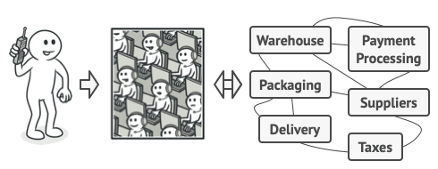

## **Facade Pattern**
https://blogshine.tistory.com/12

**퍼사드 패턴(Facade Pattern)**은 사용하기 복잡한 클래스 라이브러리에 대해 사용하기 편하게 간편한 인터페이스(API)를 구성하기 위한 구조 패턴 이다. 예를들어 라이브러리의 각 클래스와 메서드들이 어떤 목적의 동작인지 이해하기 어려워 바로 가져다 쓰기에는 난이도가 높을때, 이에 대한 적절한 네이밍과 정리를 통해 사용자로 하여금 쉽게 라이브러리를 다룰수 있도록 인터페이스를 만드는데, 우리가 교제를 보고 필기노트에 재정리를 하듯이 클래스를 재정리하는 행위로 보면 된다.

본래 프로그램이라는 것은 업데이트를 통해 점점 커지게 된다. 버전이 올라갈수록 많은 클래스들이 만들어져 서로 관계를 맺으면서 점점 복잡해지게 된다. 그래서 커다란 솔루션을 구성하려면 상호 관련된 많은 클래스들을 적절히 제어해야 할 필요성이 있다. 이때 이 처리를 개별적으로 제어하는 것이 아닌 일종의 **'창구'**를 준비하여 중계할 수 있도록 구성해준다면, 사용자는 창구를 통해서 간단한 명령 요구만 내리면 요구에 대해 필요한 모든 집약적 행위들을 창구가 알아서 처리해 결과를 내주게 된다.

고객은 복잡한 절차 지식없이 고객센터(창구)에 요구만 하면 결과를 얻는다

이처럼 퍼사드(Facade) 패턴은 복잡하게 얽혀 있는 것을 정리해서 사용하기 편한 인터페이스를 고객에게 제공한다고 보면된다. 그래서 고객은 복잡한 시스템을 알 필요없이 시스템의 외부에 대해서 단순한 인터페이스를 이용하기만 하면 된다. 퍼사드를 이용하면 자칫 동작의 목적과 같은 중요한 사항을 놓치는 실수를 줄일 수 있다.

> Info
>
> Facade라는 단어의 뜻은 건축물의 정면을 의미한다. 건축물의 정면은 보통 건축물의 이미지와 건축 의도를 나타내기 때문에 오래 전부터 특별한 디자인을 적용하여 의미를 부여했다. 이처럼 건축물 정면만 봐도 이 건물이 어떤 목적을 하는지 단번에 알수 있다는 특징을 차용하여 명명 지은 것이다.

---

### **퍼사드 패턴 구조**

- **Facade** : 서브시스템 기능을 편리하게 사용할 수 있도록 하기 위해 여러 시스템과 상호 작용하는 복잡한 로직을 재정리해서 높은 레벨의 인터페이스를 구성한다. Facade 역할은 서브 시스템의 많은 역할에 대해 ‘단순한 창구’가 된다. 클라이언트와 서브시스템이 서로 긴밀하게 연결되지 않도록 한다.
- **Additional Facade** : 퍼사드 클래스는 반드시 한개만 존재해야 한다는 규칙같은 건 없다. 연관 되지 않은 기능이 있다면 얼마든지 퍼사드 2세로 분리한다. 이 퍼사드 2세는 다른 퍼사드에서 사용할 수도 있고 클라이언트에서 직접 접근할 수도 있다.
- **SubSystem(하위 시스템)** : 수십 가지 라이브러리 혹은 클래스들
- **Client** : 서브 시스템에 직접 접근하는 대신 Facade를 사용한다.

퍼사드 패턴은 전략 패턴이나 팩토리 패턴과 같은 여타 다른 디자인 패턴과는 다르게 **클래스 구조가 정형화 되지 않은 패턴**이다. 반드시 클래스 위치는 어떻고 어떤 형식으로 위임을 해야되고 이런것이 없다. 그냥 퍼사드 클래스를 만들어 적절히 기능 집약화만 해주면 그게 디자인 패턴이 되는 것이다. (패턴이라기 보단 논리에 가깝다)

C언어나 파이썬에서 어떠한 복잡한 로직의 코드가 있으면 이걸 main 함수에서 모두 실행하는 것이 아니라, 함수(function) 분리를 통해 main 함수의 코드를 심플하게 구성해본 경험이 있을 것이다. 이를 객체 지향 프로그래밍 관점으로 치환한 것이 퍼사드 패턴이다. 즉, 퍼사드는 복잡한 것(내부에서 실행되고 있는 많은 클래스의 관계나 사용법)을 단순하게 보여주는 것에 초점을 둔다. 클라이언트로 하여금 복잡한 것을 의식하지 않도록 해주는 것이다. 

Client들은 복잡한 Subsystem을 의식하지않고 Facade라는 창구를 통해 결과를 얻는다

#### **재귀적인 Facade 패턴의 적용**

**재귀적 퍼사드**란 위에서 언급한 **Additional Facade** 를 말하는 것이다. 예를들어 다수의 클래스, 다수의 패키지를 포함하고 있는 큰 시스템에 요소 요소 마다 Facade 패턴을 여기 저기 적용하고 다시 그 Facade를 합친 Facade를 만드는 식으로, 퍼사드를 재귀적으로 구성하면 시스템은 보다 편리하게 된다. 이처럼 퍼사드는 한개만 있으라는 법은 없으며 필요에 의하면 얼마든지 늘려 의존할 수 있다.

---

### **퍼사드 패턴 특징**

#### **패턴 사용 시기**

- 시스템이 너무 복잡할때
- 그래서 간단한 인터페이스를 통해 복잡한 시스템을 접근하도록 하고 싶을때
- 시스템을 사용하고 있는 외부와 결합도가 너무 높을 때 의존성 낮추기 위할때

#### **패턴 장점**

- 하위 시스템의 복잡성에서 코드를 분리하여, 외부에서 시스템을 사용하기 쉬워진다.
- 하위 시스템 간의 의존 관계가 많을 경우 이를 감소시키고 의존성을 한 곳으로 모을 수 있다.
- 복잡한 코드를 감춤으로써, 클라이언트가 시스템의 코드를 모르더라도 Facade 클래스만 이해하고 사용 가능하다. 

> Tip
>
> 외부에서 내부 로직을 직접 사용하기 떄문에 내부 로직의 구조를 변경한다고 하거나 파라미터나 리턴값 등을 변경할 경우 직접적으로 영향을 받아 수정이힘들거나 불가능한 경우가 종종 있다. 하지만 중간에 매개체 역할을 해주는 퍼사드 객체가 있기 때문에 실제 내부 로직이 어떻게 변경이 되더라도 상관이 없어지므로 의존성이 감소된다.

#### **패턴 단점**

- 퍼사드가 앱의 모든 클래스에 결합된 God 객체가 될 수 있다
- 퍼사드 클래스 자체가 서브시스템에 대한 의존성을 가지게 되어 의존성을 완전히는 피할 수는 없다.
- 어찌되었건 추가적인 코드가 늘어나는 것이기 때문에 유지보수 측면에서 공수가 더 많이 들게 된다.
- 따라서 추상화 하고자하는 시스템이 얼마나 복잡한지 퍼사드 패턴을 통해서 얻게 되는 이점과 추가적인 유지보수 비용을 비교해보며 결정하여야 한다.

출처: [https://inpa.tistory.com/entry/GOF-💠-퍼사드Facade-패턴-제대로-배워보자](https://inpa.tistory.com/entry/GOF-%F0%9F%92%A0-%ED%8D%BC%EC%82%AC%EB%93%9CFacade-%ED%8C%A8%ED%84%B4-%EC%A0%9C%EB%8C%80%EB%A1%9C-%EB%B0%B0%EC%9B%8C%EB%B3%B4%EC%9E%90) [Inpa Dev 👨‍💻:티스토리]