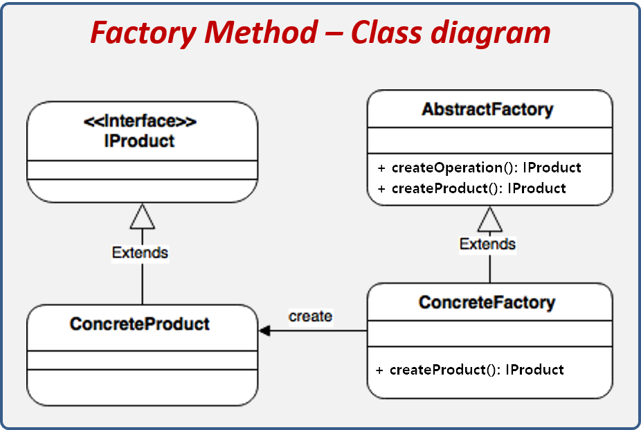
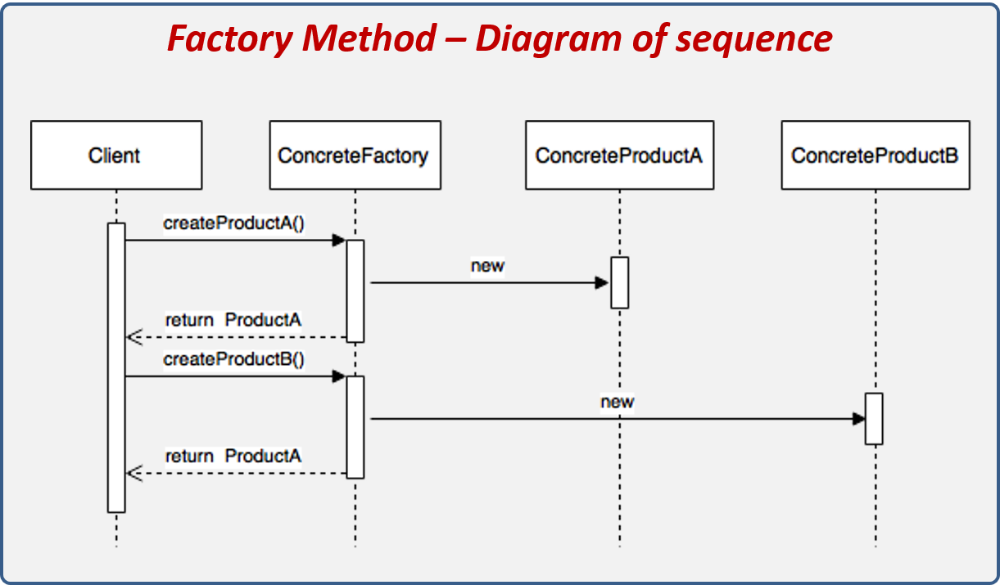
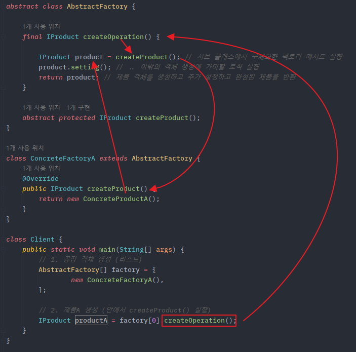
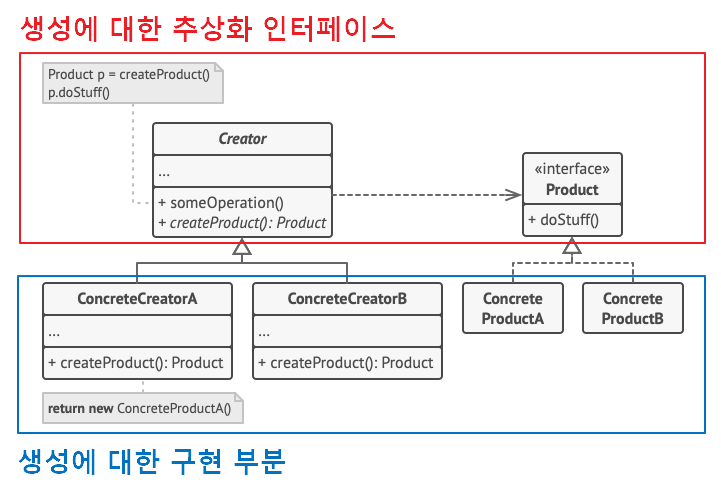

## **Factory Method Pattern**
https://blogshine.tistory.com/8

**팩토리 메소드 패턴**은 객체 생성을 공장(Factory) 클래스로 캡슐화 처리하여 대신 생성하게 하는 생성 디자인 패턴이다.

즉, 클라이언트에서 직접 ~~new~~ 연산자를 통해 제품 객체를 생성하는 것이 아닌, 제품 객체들을 도맡아 생성하는 공장 클래스를 만들고, 이를 상속하는 서브 공장 클래스의 메서드에서 여러가지 제품 객체 생성을 각각 책임 지는 것이다.

또한 객체 생성에 필요한 과정을 템플릿 처럼 미리 구성해놓고, 객체 생성에 관한 전처리나 후처리를 통해 생성 과정을 다양하게 처리하여 객체를 유연하게 정할 수 있는 특징도 있다.

### **팩토리 메서드 패턴 구조**

[](img/factory-method-pattern.png)

팩토리 객체와 제품 객체 간에 느슨한 결합 구조로 되어있다

- Creator : 최상위 공장 클래스로서, 팩토리 메서드를 추상화하여 서브 클래스로 하여금 구현하도로 함

    - 객체 생성 처리 메서드(someOperartion) : 객체 생성에 관한 전처리, 후처리를 템플릿화한 메소드
    - 팩토리 메서드(createProduct) : 서브 공장 클래스에서 재정의할 객체 생성 추상 메서드

- ConcreteCreator : 각 서브 공장 클래스들은 이에 맞는 제품 객체를 반환하도록 생성 추상 메소드를 재정의한다. 즉, 제품 객체 하나당 그에 걸맞는 생산 공장 객체가 위치된다.
- Product : 제품 구현체를 추상화
- ConcreteProduct : 제품 구현체

정리하자면, 팩토리 메소드 패턴은 객체를 만들어내는 공장(Factory 객체)을 만드는 패턴이라고 보면 된다. 그리고 어떤 클래스의 인스턴스를 만들지는 미리 정의한 공장 서브 클래스에서 결정한다.

겨우 객체 생성 가지고 이런식으로 번거롭게(?) 구성하는 이유는 객체간의 [결합도Visit Website](https://inpa.tistory.com/entry/OOP-%F0%9F%92%A0-%EA%B0%9D%EC%B2%B4%EC%9D%98-%EA%B2%B0%ED%95%A9%EB%8F%84-%EC%9D%91%EC%A7%91%EB%8F%84-%EC%9D%98%EB%AF%B8%EC%99%80-%EB%8B%A8%EA%B3%84-%EC%9D%B4%ED%95%B4%ED%95%98%EA%B8%B0-%EC%89%BD%EA%B2%8C-%EC%A0%95%EB%A6%AC)가 낮아지고 유지보수에 용이해지기 때문이다.

> Tip
>
> 객체는 사람 / 사물과 같은 유형의 형태가 될수도 있고, 전략 / 상태 와 같은 무형의 형태가 될수도 있고, 공장 과 같은 중간 생성자 역할도 한다고 보면 된다. 

> Info
>
> **[ Template Method 패턴과 Factory Method 패턴과의 관계 ]**
>
> 뭔가 이름 구성이 비슷해서 둘이 어떠한 관계가 있어 보이는데, 템플릿 메서드는 행동 패턴이고 팩토리 메서드는 생성 패턴이라 둘은 전혀 다른 패턴이다.  
> 다만 클래스 구조의 결은 둘이 같다고 보면 되는데, 인스턴스를 생성하는 공장을 Template Method 패턴으로 구성한 것이 Factory Method 패턴이 되기 때문이다.   
> Template Method 패턴에서는 하위 클래스에서 구체적인 처리 알고리즘의 내용을 만들도록 추상 메소드를 상속 시켰었다. 이 로직을 알고리즘 내용이 아닌 인스턴스 생성에 적용한 것이 Factory Method 패턴 인 것이다.

---

### **팩토리 메서드 패턴 흐름**

#### **클래스 구성**

[]file/factory-method-class-dgrm.png)

**제품(Product) 클래스**

```java
// 제품 객체 추상화 (인터페이스)
interface IProduct {
    void setting();
}

// 제품 구현체
class ConcreteProductA implements IProduct {
    public void setting() {
    }
}

class ConcreteProductB implements IProduct {
    public void setting() {
    }
}
```

**공장(Factory) 클래스**

```java
// 공장 객체 추상화 (추상 클래스)
abstract class AbstractFactory {

    // 객체 생성 전처리 후처리 메소드 (final로 오버라이딩 방지, 템플릿화)
    final IProduct createOperation() {
        IProduct product = createProduct(); // 서브 클래스에서 구체화한 팩토리 메서드 실행
        product.setting(); // .. 이밖의 객체 생성에 가미할 로직 실행
        return product; // 제품 객체를 생성하고 추가 설정하고 완성된 제품을 반환
    }

    // 팩토리 메소드 : 구체적인 객체 생성 종류는 각 서브 클래스에 위임
    // protected 이기 때문에 외부에 노출이 안됨
    abstract protected IProduct createProduct();
}

// 공장 객체 A (ProductA를 생성하여 반환)
class ConcreteFactoryA extends AbstractFactory {
    @Override
    public IProduct createProduct() {
        return new ConcreteProductA();
    }
}

// 공장 객체 B (ProductB를 생성하여 반환)
class ConcreteFactoryB extends AbstractFactory {
    @Override
    public IProduct createProduct() {
        return new ConcreteProductB();
    }
}
```

> Tip
>
> 최상위 공장 클래스는 반드시 추상 클래스로 선언할 필요 없다.  
> Java 8 버전 이후 추가된 인터페이스의 [디폴트 메서드](https://inpa.tistory.com/entry/JAVA-%E2%98%95-%EC%9D%B8%ED%84%B0%ED%8E%98%EC%9D%B4%EC%8A%A4Interface%EC%9D%98-%EC%A0%95%EC%84%9D-%ED%83%84%ED%83%84%ED%95%98%EA%B2%8C-%EA%B0%9C%EB%85%90-%EC%A0%95%EB%A6%AC)를 통해 팩토리 메서드를 선언하면 되기 때문이다.
>
> 

#### **클래스 흐름**

[](img/factory-method-class-seq.png)

```java
class Client {
    public static void main(String[] args) {
        // 1. 공장 객체 생성 (리스트)
        AbstractFactory[] factory = {
                new ConcreteFactoryA(),
                new ConcreteFactoryB()
        };

        // 2. 제품A 생성 (안에서 createProduct() 와 생성 후처리 실행)
        IProduct productA = factory[0].createOperation();

        // 3. 제품B 생성 (안에서 createProduct() 와 생성 후처리 실행)
        IProduct productB = factory[1].createOperation();
    }
}
```

[](img/abstract-factory-img.png)

---

### **팩토리 메서드 패턴 특징**

#### **패턴 사용 시기**

- 클래스 생성과 사용의 처리 로직을 분리하여 결합도를 낮추고자 할 때
- 코드가 동작해야 하는 객체의 유형과 종속성을 캡슐화를 통해 정보 은닉 처리 할 경우
- 라이브러리 혹은 프레임워크 사용자에게 구성 요소를 확장하는 방법을 제공하려는 경우 
- 기존 객체를 재구성하는 대신 기존 객체를 재사용하여 리소스를 절약하고자 하는 경우

    - 상황에 따라 적절한 객체를 생성하는 코드는 자주 중복될 수 있다. 그리고 객체 생성 방식의 변화는 해당되는 모든 코드 부분을 변경해야 하는 문제가 발생한다. 
    - 따라서 객체의 생성 코드를 별도의 클래스 / 메서드로 분리 함으로써 객체 생성의 변화에 대해 대비를 하기 위해 팩토리 메서드 패턴을 이용한다고 보면 된다. 
    - 특정 기능의 구현은 별개의 클래스로 제공되는 것이 바람직한 설계이기 때문이다.


#### **패턴 장점**

- 생성자(Creator)와 구현 객체(concrete product)의 강한 결합을 피할 수 있다.
- 팩토리 메서드를 통해 객체의 생성 후 공통으로 할 일을 수행하도록 지정해줄 수 있다.
- 캡슐화, 추상화를 통해 생성되는 객체의 구체적인 타입을 감출 수 있다.
- [단일 책임 원칙Visit Website](https://inpa.tistory.com/entry/OOP-%F0%9F%92%A0-%EC%95%84%EC%A3%BC-%EC%89%BD%EA%B2%8C-%EC%9D%B4%ED%95%B4%ED%95%98%EB%8A%94-SRP-%EB%8B%A8%EC%9D%BC-%EC%B1%85%EC%9E%84-%EC%9B%90%EC%B9%99) 준수 : 객체 생성 코드를 한 곳 (패키지, 클래스 등)으로 이동하여 코드를 유지보수하기 쉽게 할수 있으므로 원칙을 만족
- [개방/폐쇄 원칙Visit Website](https://inpa.tistory.com/entry/OOP-%F0%9F%92%A0-%EC%95%84%EC%A3%BC-%EC%89%BD%EA%B2%8C-%EC%9D%B4%ED%95%B4%ED%95%98%EB%8A%94-OCP-%EA%B0%9C%EB%B0%A9-%ED%8F%90%EC%87%84-%EC%9B%90%EC%B9%99) 준수 : 기존 코드를 수정하지 않고 새로운 유형의 제품 인스턴스를 프로그램에 도입할 수 있어 원칙을 만족 (확장성 있는 전체 프로젝트 구성이 가능)
- 생성에 대한 인터페이스 부분과 생성에 대한 구현 부분을 따로 나뉘었기 때문에 패키지 분리하여 개별로 여러 개발자가 협업을 통해 개발

[](img/abstract-inf-img.png)

#### **패턴 단점**

- 각 제품 구현체마다 팩토리 객체들을 모두 구현해주어야 하기 때문에, 구현체가 늘어날때 마다 팩토리 클래스가 증가하여 서브 클래스 수가 폭발한다.
- 코드의 복잡성이 증가한다.

## **실무에서 찾아보는 Factory Method 패턴**

### **Java**

매개변수의 값에 따라 또는 메서드에 따라 각기 다른 인스턴스를 리턴하는 단순한 버전의 팩토리 패턴으로서 팩토리 메서드 패턴과는 조금 다르다.

- java.util.Calendar 의 getInstance()
- java.util.ResourceBundle 의 getBundle()
- java.text.NumberFormat 의 getInstance()
- java.nio.charset.Charset 의 forName()
- java.net.URLStreamHandlerFactory 의 createURLStreamHandler(String)
- java.util.EnumSet 의 of()
- javax.xml.bind.JAXBContext 의 createMarshaller() and other similar methods

#### **NumberFormat의 getInstance()**

- 국가  또는 화폐에 따라 다른 표현 방식을 커버하기 위해 팩토리 메소드 패턴으로 디자인 되었다.
- NumberFormat을 구현하는 클래스는 DecimalFormat, ExponentialFormat 등이 있다.

```java
public static void main(String[] args) {
    // 팩토리 메서드로 구현체를 생성하여 반환
    NumberFormat currencyFormatter = NumberFormat.getCurrencyInstance();
    NumberFormat percentFormatter = NumberFormat.getPercentInstance();

    double x = 0.1;

    System.out.println(currencyFormatter.format(x)); // $0.10를 출력한다.
    System.out.println(percentFormatter.format(x)); // 10%를 출력한다.
}
```

#### **Calendar의 getInstance()**

- **getInstance()** 를 호출할 때마다 새로운 Calendar 객체가 생성
- Calendar는 Gregorian 형식 Julian 형식이 있는데, 이 두가지 경우를 모두 커버하기 위해 팩토리 메소드 패턴으로 디자인 되었다.

```java
public static void main(String[] args) {
    // 팩토리 메서드로 구현체를 생성하여 반환
    System.out.println("Calendar 예시 : ", Calendar.getInstance());
}
```

---

### **Spring Framework**

#### **BeanFactory**

- Object 타입의 Product 를 만드는 BeanFactory 라는 Creator
- BeanFactory 가 Creator 인터페이스이고 이를 구현한 ClassPathXmlApplicationContext, AnnotationConfigApplicationContext 가 ConcreteCreator 이다.
- 여기서 넘겨주는 Product 는 Object 타입이고 이를 넘겨 받는 인스턴스가 ConcreateProduct 가 된다.
- 컴포넌트 스캔, bean 설정 어노테이션, xml 파일 등의  bean 들이 결국 ConcreateProduct 에 해당되는 것
- ioc 컨테이너에 해당되는 클래스가 bean 팩토리 인데 이부분에 녹아져 있는 패턴이 팩토리 메서드 패턴이다.

```java
// 컴포넌트 스캔, bean 설정 어노테이션, xml 파일 등의 bean 들을 매개변수로 주어 ConcreateProduct 를 반환
BeanFactory xmlFactory = new ClassPathXmlApplicationContext("config.xml");
String hello = xmlFactory.getBean("hello", String.class);

BeanFactory javaFactory = new AnnotationConfigApplicationContext(Config.class);
String hi = javaFactory.getBean("hi", String.class);
```

출처: [https://inpa.tistory.com/entry/GOF-💠-팩토리-메서드Factory-Method-패턴-제대로-배워보자](https://inpa.tistory.com/entry/GOF-%F0%9F%92%A0-%ED%8C%A9%ED%86%A0%EB%A6%AC-%EB%A9%94%EC%84%9C%EB%93%9CFactory-Method-%ED%8C%A8%ED%84%B4-%EC%A0%9C%EB%8C%80%EB%A1%9C-%EB%B0%B0%EC%9B%8C%EB%B3%B4%EC%9E%90) [Inpa Dev 👨‍💻:티스토리]