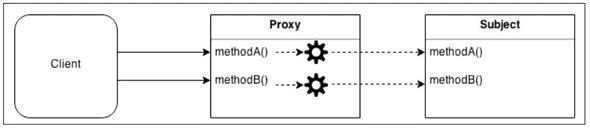
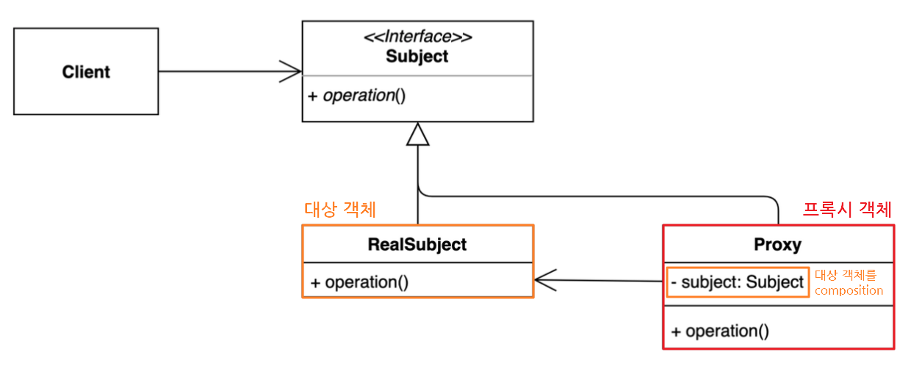
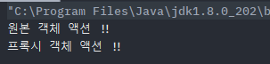
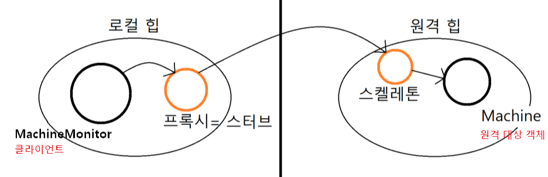
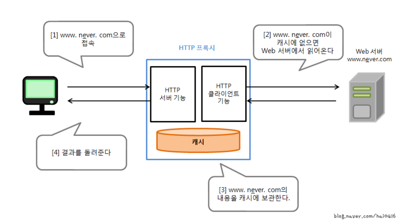
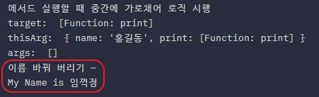

## **Proxy Pattern**

https://blogshine.tistory.com/17

프록시 패턴(Proxy Pattern)은 대상 원본 객체를 대리하여 대신 처리하게 함으로써 로직의 흐름을 제어하는 행동 패턴이다.

프록시(Proxy)의 사전적인 의미는 '대리인'이라는 뜻이다. 즉, 누군가에게 어떤 일을 대신 시키는 것을 의미하는데, 이를 객체 지향 프로그래밍에 접목해보면 클라이언트가 대상 객체를 직접 쓰는게 아니라 중간에 프록시(대리인)을 거쳐서 쓰는 코드 패턴이라고 보면 된다. 따라서 대상 객체(Subject)의 메소드를 직접 실행하는 것이 아닌, 대상 객체에 접근하기 전에 프록시(Proxy) 객체의 메서드를 접근한 후 추가적인 로직을 처리한뒤 접근하게 된다.

[](img/proxy-pattern.png)

그냥 객체를 이용하면 되지, 이렇게 번거롭게 중계 대리자를 통해 이용하는 방식을 취하는 이유는, 대상 클래스가 민감한 정보를 가지고 있거나 인스턴스화 하기에 무겁거나 추가 기능을 가미하고 싶은데, 원본 객체를 수정할수 없는 상황일 때를 극복하기 위해서 이다. 대체적으로 정리하자면 다음과 같은 효과를 누릴수 있다고 보면 된다.

1. **보안(Security)** : 프록시는 클라이언트가 작업을 수행할 수 있는 권한이 있는지 확인하고 검사 결과가 긍정적인 경우에만 요청을 대상으로 전달한다.
2. **캐싱(Caching)** : 프록시가 내부 캐시를 유지하여 데이터가 캐시에 아직 존재하지 않는 경우에만 대상에서 작업이 실행되도록 한다.
3. **데이터 유효성 검사(Data validation)** : 프록시가 입력을 대상으로 전달하기 전에 유효성을 검사한다.
4. **지연 초기화(Lazy initialization)** : 대상의 생성 비용이 비싸다면 프록시는 그것을 필요로 할때까지 연기할 수 있다.
5. **로깅(Logging)** : 프록시는 메소드 호출과 상대 매개 변수를 인터셉트하고 이를 기록한다.
6. **원격 객체(Remote objects)** : 프록시는 원격 위치에 있는 객체를 가져와서 로컬처럼 보이게 할 수 있다.

---

### **프록시 패턴 구조**

프록시는 다른 객체에 대한 접근을 제어하는 개체이다. 여기서 다른 객체를 **대상(Subject)**라고 부른다. 프록시와 대상은 동일한 인터페이스를 가지고 있으며 이를 통해 다른 인터페이스와 완전히 호환되도록 바꿀수 있다.

[](img/proxy-pattern2.png)

- **Subject** : Proxy와 RealSubject를 하나로 묶는 인터페이스 (다형성)

    - 대상 객체와 프록시 역할을 동일하게 하는 추상 메소드 ~~operation()~~ 를 정의한다.
    - 인터페이스가 있기 때문에 클라이언트는 Proxy 역할과 RealSubject 역할의 차이를 의식할 필요가 없다.

- **RealSubject** : 원본 대상 객체
- **Proxy** : 대상 객체(RealSubject)를 중계할 대리자 역할

    - 프록시는 대상 객체를 합성(composition)한다.
    - 프록시는 대상 객체와 같은 이름의 메서드를 호출하며, 별도의 로직을 수행 할수 있다 (인터페이스 구현 메소드)
    - 프록시는 흐름제어만 할 뿐 결과값을 조작하거나 변경시키면 안 된다.

- **Client** : Subject 인터페이스를 이용하여 프록시 객체를 생성해 이용.

    - 클라이언트는 프록시를 중간에 두고 프록시를 통해서 RealSubject와 데이터를 주고 받는다.


---

### **프록시 패턴 종류**

Proxy 패턴은 단순하면서도 자주 쓰이는 패턴이며, 그 활용 방식도 다양하다. 같은 프록시 객체라도 어떠한 로직을 짜느냐에 따라 그 활용도는 천차만별이 된다. Proxy 패턴의 기본형을 어떤 방식으로 변형하느냐에 따라 프록시 종류가 나뉘어지게 된다.

#### **기본형 프록시 **(Normal Proxy)****

```java
interface ISubject {
    void action();
}

class RealSubject implements ISubject {
    public void action() {
        System.out.println("원본 객체 액션 !!");
    }
}
```

```java
class Proxy implements ISubject {
    private RealSubject subject; // 대상 객체를 composition

    Proxy(RealSubject subject) {
        this.subject = subject;
    }

    public void action() {
        subject.action(); // 위임
        /* do something */
        System.out.println("프록시 객체 액션 !!");
    }
}

class Client {
    public static void main(String[] args) {
        ISubject sub = new Proxy(new RealSubject());
        sub.action();
    }
}
```

[](img/proxy-pattern-print.png)

#### **가상 프록시 **(****Virtual**** Proxy)****

- 지연 초기화 방식
- 가끔 필요하지만 항상 메모리에 적재되어 있는 무거운 서비스 객체가 있는 경우
- 이 구현은 실제 객체의 생성에 많은 자원이 소모 되지만 사용 빈도는 낮을 때 쓰는 방식이다.
- 서비스가 시작될 때 객체를 생성하는 대신에 객체 초기화가 실제로 필요한 시점에 초기화될수 있도록 지연할 수 있다.

```java
class Proxy implements ISubject {
    private RealSubject subject; // 대상 객체를 composition

    Proxy() {
    }

    public void action() {
    	// 프록시 객체는 실제 요청(action(메소드 호출)이 들어 왔을 때 실제 객체를 생성한다.
        if(subject == null){
            subject = new RealSubject();
        }
        subject.action(); // 위임
        /* do something */
        System.out.println("프록시 객체 액션 !!");
    }
}

class Client {
    public static void main(String[] args) {
        ISubject sub = new Proxy();
        sub.action();
    }
}
```

#### **보호 프록시 (Protection Proxy)**

- 프록시가 대상 객체에 대한 자원으로의 엑세스 제어(접근 권한)
- 특정 클라이언트만 서비스 객체를 사용할 수 있도록 하는 경우
- 프록시 객체를 통해 클라이언트의 자격 증명이 기준과 일치하는 경우에만 서비스 객체에 요청을 전달할 수 있게 한다.

```java
class Proxy implements ISubject {
    private RealSubject subject; // 대상 객체를 composition
    boolean access; // 접근 권한

    Proxy(RealSubject subject, boolean access) {
        this.subject = subject;
        this.access = access;
    }

    public void action() {
        if(access) {
            subject.action(); // 위임
            /* do something */
            System.out.println("프록시 객체 액션 !!");
        }
    }
}

class Client {
    public static void main(String[] args) {
        ISubject sub = new Proxy(new RealSubject(), false);
        sub.action();
    }
}
```

#### **로깅 프록시 (Logging Proxy)**

- 대상 객체에 대한 로깅을 추가하려는 경우
- 프록시는 서비스 메서드를 실행하기 전달하기 전에 로깅을 하는 기능을 추가하여 재정의한다.

```java
class Proxy implements ISubject {
    private RealSubject subject; // 대상 객체를 composition

    Proxy(RealSubject subject {
        this.subject = subject;
    }

    public void action() {
        System.out.println("로깅..................");
        
        subject.action(); // 위임
        /* do something */
        System.out.println("프록시 객체 액션 !!");

        System.out.println("로깅..................");
    }
}

class Client {
    public static void main(String[] args) {
        ISubject sub = new Proxy(new RealSubject());
        sub.action();
    }
}
```

#### **원격 프록시 **(Remote Proxy)****

- 프록시 클래스는 로컬에 있고, 대상 객체는 원격 서버에 존재하는 경우
- 프록시 객체는 네트워크를 통해 클라이언트의 요청을 전달하여 네트워크와 관련된 불필요한 작업들을 처리하고 결과값만 반환
- 클라이언트 입장에선 프록시를 통해 객체를 이용하는 것이니 원격이든 로컬이든 신경 쓸 필요가 없으며, 프록시는 진짜 객체와 통신을 대리하게 된다.

[](img/remote-proxy-pattern.png)

> Tip
>
> 참고로 프록시를 스터브라고도 부르며, 프록시로부터 전달된 명령을 이해하고 적합한 메소드를 호출해주는 역할을 하는 보조객체를 스켈레톤이라 한다.

#### **캐싱 프록시 (Caching Proxy)**

- 데이터가 큰 경우 캐싱하여 재사용을 유도
- 클라이언트 요청의 결과를 캐시하고 이 캐시의 수명 주기를 관리
>
> Info
>
> **[ HTTP Proxy ]**
>
> HTTP Proxy는 웹서버와 브라우저 사이에서 웹 페이지의 캐싱을 실행하는 소프트웨어이다. 웹 브라우저가 어떤 웹 페이지를 표시할 때 직접 웹 서버에서 그 페이지를 가져오는 것이 아니고, HTTP Proxy가 캐쉬해서 어떤 페이지를 대신해서 취득한다. 만일 최신 정보가 필요하거나 페이지의 유효기간이 지났을 때 웹 서버에 웹 페이지를 가지러 간다.   
> 이를 패턴으로 따져보면, 웹 브라우저가 Client 역할, HTTP Proxy가 Proxy 역할, 그리고 웹 서버가 RealSubcjet 역할을 한다고 보면 된다.
>
> 

---

### **프록시 패턴 특징**

#### **패턴 사용 시기**

- 접근을 제어하거가 기능을 추가하고 싶은데, 기존의 특정 객체를 수정할 수 없는 상황일때
- 초기화 지연, 접근 제어, 로깅, 캐싱 등, 기존 객체 동작에 수정 없이 가미하고 싶을 때

#### **패턴 장점**

- [개방 폐쇄 원칙(OCP)Visit Website](https://inpa.tistory.com/entry/OOP-%F0%9F%92%A0-%EC%95%84%EC%A3%BC-%EC%89%BD%EA%B2%8C-%EC%9D%B4%ED%95%B4%ED%95%98%EB%8A%94-OCP-%EA%B0%9C%EB%B0%A9-%ED%8F%90%EC%87%84-%EC%9B%90%EC%B9%99) 준수

    - 기존 대상 객체의 코드를 변경하지 않고 새로운 기능을 추가할 수 있다.

- [단일 책임 원칙(SRP)Visit Website](https://inpa.tistory.com/entry/OOP-%F0%9F%92%A0-%EC%95%84%EC%A3%BC-%EC%89%BD%EA%B2%8C-%EC%9D%B4%ED%95%B4%ED%95%98%EB%8A%94-SRP-%EB%8B%A8%EC%9D%BC-%EC%B1%85%EC%9E%84-%EC%9B%90%EC%B9%99) 준수 
    
    - 대상 객체는 자신의 기능에만 집중 하고, 그 이외 부가 기능을 제공하는 역할을 프록시 객체에 위임하여 다중 책임을 회피 할 수 있다.

- 원래 하려던 기능을 수행하며 그외의 부가적인 작업(로깅, 인증, 네트워크 통신 등)을 수행하는데 유용하다
- 클라이언트는 객체를 신경쓰지 않고, 서비스 객체를 제어하거나 생명 주기를 관리할 수 있다.
- 사용자 입장에서는 프록시 객체나 실제 객체나 사용법은 유사하므로 사용성에 문제 되지 않는다.

#### **패턴 단점**

- 많은 프록시 클래스를 도입해야 하므로 코드의 복잡도가 증가한다.

    - 예를들어 여러 클래스에 로깅 기능을 가미 시키고 싶다면, 동일한 코드를 적용함에도 각각의 클래스에 해당되는 프록시 클래스를 만들어서 적용해야 되기 때문에 코드량이 많아지고 중복이 발생 된다.
    - 자바에서는 리플렉션에서 제공하는 동적 프록시(Dynamic Proxy) 기법을 이용해서 해결할 수 있다. (후술)

- 프록시 클래스 자체에 들어가는 자원이 많다면 서비스로부터의 응답이 늦어질 수 있다.

## **실무에서 찾아보는 Proxy 패턴**

### **Java**

- java.lang.reflect.Proxy
- java.rmi.* (원격 프록시 모듈)
- javax.ejb.EJB 
- javax.inject.Inject
- javax.persistence.PersistenceContext

#### **Dynamic Proxy**

개발자가 직접 디자인 패턴으로서 프록시 패턴을 구현해도 되지만, 자바 JDK에서는 별도로 프록시 객체 구현 기능을 지원한다. 이를 동적 프록시(Dynamic Proxy) 기법이라고 불리운다.

동적 프록시는 개발자가 직접 일일히 프록시 객체를 생성하는 것이 아닌, 애플리케이션 실행 도중 java.lang.reflect.Proxy 패키지에서 제공해주는 API를 이용하여 동적으로 프록시 인스턴스를 만들어 등록하는 방법으로서, 자바의 [Reflection APIVisit Website](https://inpa.tistory.com/entry/JAVA-%E2%98%95-%EB%88%84%EA%B5%AC%EB%82%98-%EC%89%BD%EA%B2%8C-%EB%B0%B0%EC%9A%B0%EB%8A%94-Reflection-API-%EC%82%AC%EC%9A%A9%EB%B2%95) 기법을 응용한 연장선의 개념이다. 그래서 별도의 프록시 클래스 정의없이 런타임으로 프록시 객체를 동적으로 생성해 이용할 수 있다는 장점이 있다.

> Java Dynamic Proxy 자바 프로그래밍의 디자인 패터중 하나인 프록시 패턴은 초기화 지연, 접근 제어, 로깅, 캐싱 등, 기존 대상 원본 객체를 수정 없이 추가 동작 기능들을 가미하고 싶을 때 사용하는

```java
// 대상 객체와 프록시를 묶는 인터페이스
interface Animal {
    void eat();
}

// 프록시를 적용할 타겟 객체
class Tiger implements Animal{
    @Override
    public void eat() {
        System.out.println("호랑이가 음식을 먹습니다.");
    }
}
```

```java
public class Client {
    public static void main(String[] arguments) {
		
        // newProxyInstance() 메서드로 동적으로 프록시 객체를 생성할 수 있다.
        Animal tigerProxy = (Animal) Proxy.newProxyInstance(
                Animal.class.getClassLoader(), // 대상 객체의 인터페이스의 클래스로더
                new Class[]{Animal.class}, // 대상 객체의 인터페이스
                new InvocationHandler() { // 프록시 핸들러
                    @Override
                    public Object invoke(Object proxy, Method method, Object[] args) throws Throwable {
                        Object target = new Tiger();

                        System.out.println("----eat 메서드 호출 전----");

                        Object result = method.invoke(target, args); // 타겟 메서드 호출

                        System.out.println("----eat 메서드 호출 후----");

                        return result;
                    }
                }
        );

        tigerProxy.eat();
    }
}
```

---

### **Spring Framework**

#### **스프링 AOP**

스프링 프레임워크에서는 내부적으로 프록시 기술을 정말 많이 사용하고 있다. (AOP, JPA 등)

스프링에서는 Bean을 등록할 때 [SingletonVisit Website](https://inpa.tistory.com/entry/GOF-%F0%9F%92%A0-%EC%8B%B1%EA%B8%80%ED%86%A4Singleton-%ED%8C%A8%ED%84%B4-%EA%BC%BC%EA%BC%BC%ED%95%98%EA%B2%8C-%EC%95%8C%EC%95%84%EB%B3%B4%EC%9E%90)을 유지하기 위해 Dynamic Proxy 기법을 이용해 프록시 객체를 Bean으로 등록한다. 또한 Bean으로 등록하려는 기본적으로 객체가 Interface를 하나라도 구현하고 있으면 JDK를 이용하고 Interface를 구현하고 있지 않으면 내장된 CGLIB 라이브러리를 이용한다.

```java
@Service
public class GameService {
	public void startDame() {
    	System.out.println("이 자리에 오신 여러분을 진심으로 환영합니다.");
    }
}
```

```java
@Aspect
@Comonent
public class PerfAspect {
	@Around("bean(gameService)")
	public void timestamp(ProceedingJoinPoint point) throws Throwable {
    	System.out.println("프록시 실행 1");
        
        point.proceed(); // 대상 객체의 원본 메서드를 실행
        
        System.out.println("프록시 실행 2");
    }
}
```

---

### **JavaScript**

#### **Proxy / Reflect 객체**

자바에서도 Proxy 객체를 별도로 지원하듯이, 자바스크립트 진영에서도 독립적인 Proxy 객체가 존재한다.

자바스크립트에서의 Proxy 객체의 역할은 대상 객체을 감싸서(wrapping), 속성 조회, 할당, 열거 및 함수 호출 등 여러 기본 동작을 가로채(trap) 특별한 다른 동작을 가미시키는 대리자 역할을 한다. 대상 객체는 Object, Array 등 자바스크립트의 모든 자료형이 대상이 될 수 있다.

> JavaScript Proxy 객체 프록시(Proxy)의 사전적 뜻은 '대리인', '대리'라는 뜻이다. 서버를 다뤄본 독자분들이라면 프록시 서버에 대해 질리도록 들어봤을 것이다. 프록시 서버는 클라이언트와 본 서버

```js
let obj = {
    name: '홍길동',
    print: function () {
        console.log(`My Name is ${this.name}`);
    },
};

// print 함수를 프록시로 감싸기
obj.print = new Proxy(obj.print, {
    apply(target, thisArg, args) {
        console.log('메서드 실행할 때 중간에 가로채어 로직 시행');

        console.log('target: ', target); // 대상 함수
        console.log('thisArg: ', thisArg); // this의 값
        console.log('args: ', args); // 매개변수 목록 (배열)

        console.log('이름 바꿔 버리기 ~');
        thisArg.name = '임꺽정';

        Reflect.apply(target, thisArg, args); // 대상 원본 함수 실행
    },
});

obj.print();
```

[](img/proxy-js-print.png)

출처: [https://inpa.tistory.com/entry/GOF-💠-프록시Proxy-패턴-제대로-배워보자](https://inpa.tistory.com/entry/GOF-%F0%9F%92%A0-%ED%94%84%EB%A1%9D%EC%8B%9CProxy-%ED%8C%A8%ED%84%B4-%EC%A0%9C%EB%8C%80%EB%A1%9C-%EB%B0%B0%EC%9B%8C%EB%B3%B4%EC%9E%90) [Inpa Dev 👨‍💻:티스토리]