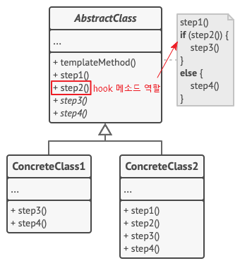
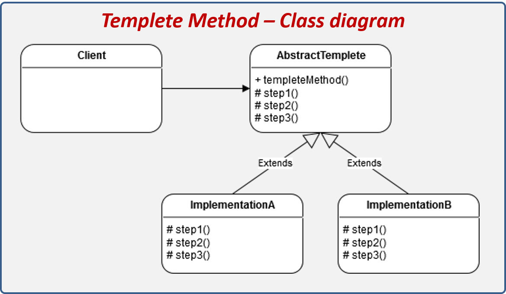

## **Template Method Pattern**
https://blogshine.tistory.com/13

템플릿 메서드(Template Method) 패턴은 **여러 클래스에서 공통으로 사용하는 메서드를 템플릿화** 하여 상위 클래스에서 정의하고, **하위 클래스마다 세부 동작 사항을 다르게 구현**하는 패턴이다.

즉, **변하지 않는 기능(템플릿)은 상위 클래스에** 만들어두고 **자주 변경되며 확장할 기능은 하위 클래스에서** 만들도록 하여, 상위의 메소드 실행 동작 순서는 고정하면서 세부 실행 내용은 다양화 될 수 있는 경우에 사용된다.

템플릿 메소드 패턴은 상속이라는 기술을 극대화하여, **알고리즘의 뼈대**를 맞추는 것에 초점을 둔다. 이미 수많은 프레임워크에서 많은 부분에 템플릿 메소드 패턴 코드가 우리도 모르게 적용되어 있다.

> Tip
> 디자인 패턴에서의 템플릿은 변하지 않는 것을 의미한다.


### **템플릿 메서드 패턴 구조**

[](img/template-pattern.png)

- **AbstractClass(추상 클래스)** : 템플릿 메소드를 구현하고, 템플릿 메소드에서 돌아가는 추상 메소드를 선언한다. 이 추상 메소드는 하위 클래스인 ConcreteClass 역할에 의해 구현된다.
- **ConcreteClass(구현 클래스)** : AbstractClass를 상속하고 추상 메소드를 구체적으로 구현한다. ConcreteClass에서 구현한 메소드는 AbstractClass의 템플릿 메소드에서 호출된다.

#### **hook 메서드**
[](img/template-method-pattern.png)

훅(hook) 메소드는 부모의 템플릿 메서드의 **영향이나 순서를 제어**하고 싶을때 사용되는 메서드 형태를 말한다.

위의 그림에서 보듯이 템플릿 메서드 내에 실행되는 동작을 **step2()** 이라는 메서드의 참, 거짓 유무에 따라 다음 스텝을 어떻게 이어나갈지 지정한다. 이를 통해 자식 클래스에서 좀더 유연하게 템플릿 메서드의 알고리즘 로직을 다양화 할 수 있다는 특징이 있다.

훅 메소드는 추상 메소드가 아닌 일반 메소드로 구현하는데, 선택적으로 오버라이드 하여 자식 클래스에서 제어하거나 아니면 놔두거나 하기 위해서 이다.

---

### **템플릿 메서드 패턴 흐름**

#### **클래스 구성**
[](img/template-method-class.png)

### **템플릿 메소드 패턴 특징**

#### **패턴 사용 시기**

- 클라이언트가 알고리즘의 특정 단계만 확장하고, 전체 알고리즘이나 해당 구조는 확장하지 않도록 할때
- 동일한 기능은 상위 클래스에서 정의하면서 확장, 변화가 필요한 부분만 하위 클래스에서 구현할 때

#### **패턴 장점**

- 클라이언트가 대규모 알고리즘의 특정 부분만 재정의하도록 하여, 알고리즘의 다른 부분에 발생하는 변경 사항의 영향을 덜 받도록 한다.
- 상위 추상클래스로 로직을 공통화 하여 코드의 중복을 줄일 수 있다.
- 서브 클래스의 역할을 줄이고, 핵심 로직을 상위 클래스에서 관리하므로서 관리가 용이해진다

    - 헐리우드 원칙 (Hollywood Principle) : 고수준 구성요소에서 저수준을 다루는 원칙 (추상화에 의존)


#### **패턴 단점**

- 알고리즘의 제공된 골격에 의해 유연성이 제한될 수 있다.
- 알고리즘 구조가 복잡할수록 템플릿 로직 형태를 유지하기 어려워진다.
- 추상 메소드가 많아지면서 클래스의 생성, 관리가 어려워질 수 있다.
- 상위 클래스에서 선언된 추상 메소드를 하위 클래스에서 구현할 때, 그 메소드가 어느 타이밍에서 호출되는지 클래스 로직을 이해해야 할 필요가 있다.
- 로직에 변화가 생겨 상위 클래스를 수정할 때, 모든 서브 클래스의 수정이 필요 할수도 있다.
- 하위 클래스를 통해 기본 단계 구현을 억제하여 리스코프 치환 법칙을 위반할 여지가 있다.

## **실무에서 찾아보는 Template Method 패턴**

### **Java**

- **java.io.InputStream**, **java.io.OutputStream**, **java.io.Reader**, **java.io.Writer** 의 일반 메서드를 하위 클래스가 재정의
- **java.util.AbstractList**, **java.util.AbstractSet**, **java.util.AbstractMap** 의 일반 메서드를 하위 클래스가 재정의
- **javax.servlet.http.HttpServlet**의 모든 **doXXX()** 메서드는 기본적으로 응답에 HTTP 405 "Method Not Allowed" 리턴 코드를 보내기 때문에 이들을 상속하여 재정의 하여 사용한다.

#### **HttpServlet**

우리가 HttpServlet 클래스를 상속 하고 **doGet()** 과 **doPost()** 메서드를 오버라이드 하면, 상위 서블릿 객체에서 템플릿 로직을 수행하다가 doGet, doPost 를 호출해야 할 때 하위 클래스를 참조하여 메서드를 실행한다.

```java
public class MyHello extends HttpServlet {

    @Override
    protected void doGet(HttpServletRequest req, HttpServletResponse resp) throws ServletException, IOException {
        super.doGet(req, resp);
    }

    @Override
    protected void doPost(HttpServletRequest req, HttpServletResponse resp) throws ServletException, IOException {
        super.doPost(req, resp);
    }
}
```

#### **AbstractMap**

AbstractMap<K,V> 클래스에 정의 되어있는 **get()** 메서드를 이를 상속하는 HashMap, TreeMap 등 서브클래스에서 오버라이드하여 자신만의 구현 방법으로 다른 방식으로 재정의 하고 있는 것을 볼 수 있다. 꼭 추상 메소드를 재정의 해야되는게 아니라 일반 메소드도 템플릿에 고정되어 실행되는 것이라면 오버라이딩하여 재정의 하면 곧 알고리즘 변화가 되기 때문이다.

**AbstractMap<K,V> 의 get() 메소드**

```java
public V get(Object key) {
    Iterator<Entry<K,V>> i = entrySet().iterator();
    if (key==null) {
        while (i.hasNext()) {
            Entry<K,V> e = i.next();
            if (e.getKey()==null)
                return e.getValue();
        }
    } else {
        while (i.hasNext()) {
            Entry<K,V> e = i.next();
            if (key.equals(e.getKey()))
                return e.getValue();
        }
    }
    return null;
}
```

**HashMap<K,V> extends AbstractMap<K,V> 의 get() 메소드**

```java
public V get(Object key) {
    Node<K,V> e;
    return (e = getNode(hash(key), key)) == null ? null : e.value;
}
```

**TreeMap<K,V> extends AbstractMap<K,V> 의 get() 메소드**

```java
public V get(Object key) {
    Entry<K,V> p = getEntry(key);
    return (p==null ? null : p.value);
}
```

---

### **Spring Framework**

#### **Configuration**

WebSecurityConfigureAdapter 클래스를 상속 하고 **configure()** 메서드를 오버라이드하면, 스프링 프레임워크의 Config 로직의 거대한 알고리즘 중 일부를 구현하게 되는 것이다.

```java
public class TemplateInSpring {

    public static void main(String[] args) {
        // TODO 템플릿-콜백 패턴
        // JdbcTemplate
        JdbcTemplate jdbcTemplate = new JdbcTemplate();
        jdbcTemplate.execute("insert");

        // RestTemplate
        RestTemplate restTemplate = new RestTemplate();

        HttpHeaders headers = new HttpHeaders();
        headers.setAccept(Arrays.asList(MediaType.APPLICATION_JSON));
        headers.set("X-COM-PERSIST", "NO");
        headers.set("X-COM-LOCATION", "USA");

        HttpEntity<String> entity = new HttpEntity<String>(headers);
        ResponseEntity<String> responseEntity = restTemplate
                .exchange("http://localhost:8080/users", HttpMethod.GET, entity, String.class);
    }

    @Configuration
    class SecurityConfig extends WebSecurityConfigurerAdapter {

        @Override
        protected void configure(HttpSecurity http) throws Exception {
            http.authorizeRequests().anyRequest().permitAll();
        }
    }
}
```

---

## **관련된 디자인 패턴 종류**

### **Strategy vs Temaplate Method**

#### **패턴 유사점**

전략 패턴과 템플릿 메서드 패턴은 **알고리즘을 때에 따라 적용한다는 컨셉**으로써, 둘이 공통점을 가지고 있다.

전략 및 템플릿 메서드 패턴은 [개방형 폐쇄 원칙Visit Website](https://inpa.tistory.com/entry/OOP-%F0%9F%92%A0-%EC%95%84%EC%A3%BC-%EC%89%BD%EA%B2%8C-%EC%9D%B4%ED%95%B4%ED%95%98%EB%8A%94-OCP-%EA%B0%9C%EB%B0%A9-%ED%8F%90%EC%87%84-%EC%9B%90%EC%B9%99)을 충족하고 코드를 변경하지 않고 소프트웨어 모듈을 쉽게 확장할 수 있도록 하는 데 사용할 수 있다. 

#### **패턴 차이점**

전략 패턴은 합성(composition)을 통해 해결책을 강구하며, 템플릿 메서드 패턴은 상속(inheritance)을 통해 해결책을 제시한다. 그래서 전략 패턴은 클라이언트와 객체 간의 결합이 느슨한 반면, 템플릿 메서드 패턴에서는 두 모듈이 더 밀접하게 결합된다. (결합도가 높으면 안좋음)

전략 패턴에서는 대부분 인터페이스를 사용하지만, 템플릿 메서드 패턴서는 주로 추상 클래스나 구체적인 클래스를 사용한다.

전략 패턴에서는 전체 전략 알고리즘을 변경할 수 있지만, 템플릿 메서드 패턴에서는 알고리즘의 일부만 변경되고 나머지는 변경되지 않은 상태로 유지된다. (템플릿에 종속)

따라서 단일 상속만이 가능한 자바에서 상속 제한이 있는 템플릿 메서드 패턴보다는, 다양하게 많은 전략을 implements 할 수 있는 전략 패턴이 협업에서 많이 사용되는 편이다.

출처: [https://inpa.tistory.com/entry/GOF-💠-템플릿-메소드Template-Method-패턴-제대로-배워보자](https://inpa.tistory.com/entry/GOF-%F0%9F%92%A0-%ED%85%9C%ED%94%8C%EB%A6%BF-%EB%A9%94%EC%86%8C%EB%93%9CTemplate-Method-%ED%8C%A8%ED%84%B4-%EC%A0%9C%EB%8C%80%EB%A1%9C-%EB%B0%B0%EC%9B%8C%EB%B3%B4%EC%9E%90) [Inpa Dev 👨‍💻:티스토리]